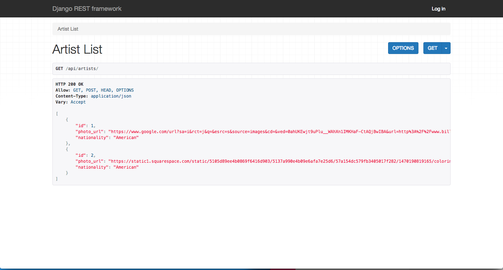

[](https://generalassemb.ly/education/web-development-immersive)

# Django REST Framework

The Django apps we've built so far have used server-side rendering and Django's
built-in templating language to generate HTML. But what if we want to use Django
to create an API?

We can do so with the
[Django REST Framework](https://www.django-rest-framework.org/).

## Prerequisites

- Django
- Understanding of REST and APIs

## Objectives

By the end of this, developers should be able to:

- Install and use Django REST Framework
- Implement an API in Django

## Introduction

So far, we have written full-stack Django applications that use Django's builtin
templating language to write our applications. When we are building applications
in Django that use front end frameworks or have live updating data, we have to
use an API for our back end applications. Today, we are going to learn how to
convert our Tunr application we have been working on to a JSON API using a
package called Django REST Framework.

This is similar to how we converted our MEHN stack app to the MERN stack:
instead of the API returning rendered HTML (using handlebars), we had it return
JSON.

The main difference is that Django REST framework has some powerful tools and
conventions for controlling how we get to receive and send JSON data. With the
MERN stack, we had to do all that manually.

## Review: APIs (5 min / 0:10)

<details>
  <summary><strong>What is an API?</strong></summary>

> API stands for "Application Programming Interface." While it technically
> applies to all of software design, the term has come to refer to web
> applications that respond with JSON, XML, or some other raw data format

</details>

<details>

<summary><strong>What tools and libraries do we use to access other
APIs from within our programs?</strong></summary>

> [JavaScript's fetch method](https://developer.mozilla.org/en-US/docs/Web/API/Fetch_API/Using_Fetch),
> [Axios](https://github.com/axios/axios), or any other means of doing HTTP
> requests, like [Postman](https://www.getpostman.com/)

</details>

<details>
  <summary><strong>What information do we need to provide in order to be able to retrieve information from an API? What about for modifying data in an API?</strong></summary>

> In order to "GET" or "DELETE" information, we need to provide a `url`, `type`,
> (HTTP method) and `dataType` (API data format). In order to "POST" or "PUT",
> we also need to provide some `data`.

> Example:

```js
fetch("/artists", {
  method: "POST",
  body: JSON.stringify({
    artist: {
      name: "Limp Bizkit",
      nationality: "USA",
      photo_url:
        "http://nerdist.com/wp-content/uploads/2014/12/limp_bizkit-970x545.jpg"
    }
  })
})
  .then(response => response.json())
  .then(response => {
    console.log(response);
  });
```

</details>

## JSON Responses in Django (15 min / 0:25)

Using Django's built-in `JsonResponse`, we can send dictionaries or lists as
JSON objects in Django without installing any libraries.

For example:

```py
# views.py
from django.http import JsonResponse

def artist_list(request):
    data = {
        'name': 'Kanye',
        'photo_url': 'https://upload.wikimedia.org/wikipedia/commons/thumb/1/11/Kanye_West_at_the_2009_Tribeca_Film_Festival.jpg/1920px-Kanye_West_at_the_2009_Tribeca_Film_Festival.jpg',
        'nationality': 'USA'
    }
    return JsonResponse(data)
```

We could also convert our QuerySet of data from our database to a list and then
send that as a JsonResponse. Note: you could also use a serializer to convert it
to a dictionary and send the data that way.

```py
# views.py
from django.http import JsonResponse

def artist_list(request):
    artists = Artist.objects.all().values('name', 'nationality', 'photo_url') # only grab some attributes from our database, else we can't serialize it.
    artists_list = list(artists) # convert our artists to a list instead of QuerySet
    return JsonResponse(artists_list, safe=False) # safe=False is needed if the first parameter is not a dictionary.
```

This method of sending JSON responses is very similar to what we did in Express;
however, there is a more expressive way of doing this using Django REST
Framework.

## Django REST Framework

Django REST framework is a package that works nicely with Django's base
functionality. It has a lot of advantages over just sending a JSON response, not
to mention a nice interface. It will even generate an administrator interface
for you to interact with your API in the browser - so no need to use Postman! It
is also very customizable, so if you want to change how your API renders, you
can probably do it!

It is also very widely used - it is used by Mozilla, Red Hat, Heroku,
Eventbrite, Instagram, Pinterest, and BitBucket. An increasingly popular stack
among startups is: Django Rest Framework for the back end and React for the
front end!

## Installation and Configuration (15 min / 0:40)

Change into your `tunr` project directory and make sure you have the latest code
from the views and templates lesson. If not, checkout the solution branch from
that lesson which is called `views-solution`. Make sure your virtualenv is
activated, and also make sure your database user permissions are set up
properly.

Before we get started, install the `djangorestframework` dependency.

```bash
$ pipenv install djangorestframework
```

Also, add it to your `INSTALLED_APPS` list in your `settings.py` so that you can
use it within your project.

```python
INSTALLED_APPS = [
    # ...
    'rest_framework',
]
```

Further down in your `settings.py` file, configure Django REST Framework to
require authentication to create, update, or delete items using your API.
Unauthorized users will still be able to perform read actions on your data. This
is all the configuration that you need to set up these permissions!

Add this variable as a new dictionary, anywhere in `settings.py`:

```python
REST_FRAMEWORK = {
    # Use Django's standard `django.contrib.auth` permissions,
    # or allow read-only access for unauthenticated users.
    'DEFAULT_PERMISSION_CLASSES': [
        'rest_framework.permissions.DjangoModelPermissionsOrAnonReadOnly'
    ]
}
```

> If you would like to use JWT in your Django REST framework app,
> [Django REST framework JWT](http://getblimp.github.io/django-rest-framework-jwt/)
> is awesome and has in-depth documentation on getting it setup. If you are
> using a front-end framework for your Django application, this is probably the
> way to go!

We also have to include some URLs for authentication for Django REST framework.
These URLs will be used for sign-in and sign-out pages. The framework will
handle linking to these pages, we just need to include the URLs that have
already been set up.

In the `urls` list in `tunr_django/urls.py`, add the following to your
`urlpatterns` list:

```python
path('api-auth/', include('rest_framework.urls', namespace='rest_framework'))
```

## Serializers (20 min / 1:00)

[ Serializers ](https://www.django-rest-framework.org/api-guide/serializers/)
allow us to convert our data from QuerySets (the data type returned by Django's
ORM) to data that can easily be converted to JSON (or XML) and rendered to our
API. There are several types of serializers built into Django REST framework;
however, we will be using the `HyperlinkedModelSerializer` today. This
serializer allows us to specify model fields that we want to include in our API
and it will generate our JSON accordingly. It will also allow us to link from
one model to another.

> Read more about
> [ Serializers in the documentation](https://www.django-rest-framework.org/api-guide/serializers/)

In this case, we want all of the fields from the Artist model in our serializer,
so we will include all of them in our `fields` tuple.

We will create a new file in the root of our `tunr` app folder, called
`serializers.py` to hold our serializer class.

```py
from rest_framework import serializers
from .models import Artist

class ArtistSerializer(serializers.HyperlinkedModelSerializer):
    songs = serializers.HyperlinkedRelatedField(
        view_name='song_detail',
        many=True,
        read_only=True
    )
```

Awesome, this is a great start. We also want to describe all the fields in
artist. We'll do this using a Meta class.

Add a Meta class **inside** the ArtistSerializer class:

```diff
class ArtistSerializer(serializers.HyperlinkedModelSerializer):
    songs = serializers.HyperlinkedRelatedField(
        view_name='song_detail',
        many=True,
        read_only=True
    )
+   class Meta:
+       model = Artist
+       fields = ('id', 'photo_url', 'nationality', 'name', 'songs')
```

Lets break down what's going on here.

We are creating a `HyperlinkedRelatedField` and pointing it to the song_detail
view. This allows us to link one model to another using a hyperlink. So when we
inspect the json response, we'll be able to just follow a url that takes us to
from the current `Artist` to the related `Song`.

The `Meta` class within our `Artist` serializer class specifies meta data about
our serializer. In this class, we tell it the model and what fields we want to
serialize.

The `view_name` specifies the name of the view given in the `urls.py` file. If
we look at our `tunr/urls.py` file, we already have a path like this:

```py
path('songs/<int:pk>', views.song_detail, name='song_detail')
```

### You Do: Create a Serializer for Songs (10 min / 1:10)

> 5 min exercise, 5 min review

In the serializers file, add a second serializer for the Song class. Again,
include all of the fields from the model in your API.

> Bonus: Try out a different
> [serializer](http://www.django-rest-framework.org/api-guide/serializers) to
> relate your models!

> [Solution](https://git.generalassemb.ly/dc-wdi-python-django/tunr/blob/django-rest-framework/tunr/serializers.py)

## Break (10 min / 1:20)

## Views (20 min / 1:40)

Django REST framework has a bunch of utility functions and classes for
implementing sets of views in Django. Instead of creating each view
individually, Django REST framework will create multiple views for us in a few
lines of code.

The documentation on the views and utilities that DRF provides for generating
Views is great:

- [Class-based views](https://www.django-rest-framework.org/api-guide/views/)
- [Generic views](https://www.django-rest-framework.org/api-guide/generic-views/)
- [ViewSets](https://www.django-rest-framework.org/api-guide/viewsets/)

For example, we can use the `ListCreateAPIView` to create both our list view for
our API and our create view. We can also use `RetrieveUpdateDestroyAPIView` to
create show, update, and delete routes for our API.

In this code example, we'll allow permissions for List and Create (CR in CRUD)
on the ArtistList view. For ArtistDetail, we'll allow Retrieve, Update, Delete
(RUD in CRUD) permissions.

We can get rid of all the prior code in `tunr/views.py` since we're not going to
be rendering any templates. We'll also have to get rid of all the urls because
they point to views that now no longer exist.

```py
# views.py

from rest_framework import generics
from .serializers import ArtistSerializer
from .models import Artist

class ArtistList(generics.ListCreateAPIView):
    queryset = Artist.objects.all()
    serializer_class = ArtistSerializer

class ArtistDetail(generics.RetrieveUpdateDestroyAPIView):
    queryset = Artist.objects.all()
    serializer_class = ArtistSerializer
```

### You Do: Add Views for the Songs (10 min / 1:50)

Add in the views for the songs.

> [Solution](https://git.generalassemb.ly/dc-wdi-python-django/tunr/blob/django-rest-framework/tunr/views.py)

## URLs (20 min / 2:10)

Since Django can handle multiple request types in one view and using one url, we
just need to set up two routes: one for the single view and one for the list
view.

```py
# tunr/urls.py
from django.urls import path
from . import views
from rest_framework.routers import DefaultRouter

urlpatterns = [
    path('artists/', views.ArtistList.as_view(), name='artist_list'),
    path('artists/<int:pk>', views.ArtistDetail.as_view(), name='artist_detail'),
]
```

### You Do: Add URLs for the Song Views (10 min / 2:20)

Add in the urls for the song views.

> [Solution](https://git.generalassemb.ly/dc-wdi-python-django/tunr/blob/django-rest-framework/tunr/urls.py)

## Testing! (10 min / 2:30)

Now let's hit the urls we just built out and see what happens.

- `http://localhost:8000/artists/`
- `http://localhost:8000/artists/1/`
- `http://localhost:8000/songs/`
- `http://localhost:8000/songs/1/`



Awesome right!

Now wait a minute, we should also be able to create data. How come we can't do
that?

Maybe we should try logging in first.....

> If you can't login, try running `python3 manage.py createsuperuser` and follow
> the prompts. Then, login with that user and password.

Once we're logged in we should see a form that allows us to create data! woo!

## Cors

We need to configure CORS in order for other applications to use the API we just
created.

This is outside of the scope of today's lesson, but it's super simple!

The
[Django Rest Documentation page on AJAX](https://www.django-rest-framework.org/topics/ajax-csrf-cors/)
is a great place to get started. It endorses the
[Django Cors Headers](https://github.com/ottoyiu/django-cors-headers/)
middleware, which can be installed like any other dependency with `pipenv` and
is configured in the Project's `settings.py`

## More!

There's a lot more we can do with DRF, like:

[Validation](https://www.django-rest-framework.org/api-guide/validators/), which
lets us verify that the data we've retrieved from front-end or database is
complete.

[Throttling](https://www.django-rest-framework.org/api-guide/throttling/), which
allows us to limit the number of requests per second/minute/hour that we
recieve, both total and from specific users.

[Pagination](https://www.django-rest-framework.org/api-guide/pagination/), in
case we have a lot of records and only want to return 10 or 20 or 100 at a time.
Otherwise, our database may suffer when running a query over many thousands of
records.

[Filtering](https://www.django-rest-framework.org/api-guide/filtering/), which
allows us to customize our queries. For example maybe we want to limit the
records and only show ones that are associated with the currently logged-in
user.

## Additional Resources

- [DRF Extensions](https://chibisov.github.io/drf-extensions/docs/)

## Contributors

Original content from [DC at 4e354f](https://git.generalassemb.ly/dc-wdi-python-django/django-rest-framework/commit/4e354f663561cc7815c0bb6561715cbd5993ccbf). Original contributors can be found in that repository's history. Recent contributors can be found in this repository's history.

## [License](LICENSE)

1. All content is licensed under a CC­BY­NC­SA 4.0 license.
2. All software code is licensed under GNU GPLv3. For commercial use or
   alternative licensing, please contact legal@ga.co.
