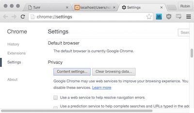

# Exploring Cookies

A session variable is a piece of data stored in an app's memory that is associated with one particular session -- that is, one instance of someone using your app.

Let's say our app has 4 active sessions. There are two session variables: `user_id` and `display_name`. (`display_name` is just an example; we won't be doing anything with it.) Here's a visual representation of how Rails stores the session data:

| Session ID | Data |
|:--- |:--- |
| e91dfd | `{user_id: 10, display_name: "xXxJohnSmithxXx"}` |
| 10d913 | `{user_id: 3, display_name: "ReginaGeorge89"}` |
| 53821d | `{user_id: 804, display_name: "JuanBat1337"}` |
| 163673 | `{user_id: 543, display_name: "StevesDad"}` |

Storing this data is the easy part. The tricky part is knowing **how to associate a particular session with a particular computer.**

Let's say `xXxJohnSmithxXx` is using the app from New York and `ReginaGeorge89` is using your app from San Francisco. How does our app "know" that session `e91dfd` belongs to the New York computer and not the San Francisco computer?

Any time you use an app it automatically generates a session ID for you and tells your web browser to save it as a **cookie**. This is a small, temporary piece of data stored *in the web browser*, whereas a session variable is the same thing but stored *in the server*.

`xXxJohnSmithxXx`'s web browser has a table somewhere inside it like this:

| Website | Cookies |
|:--- |:--- |
| amazon.com | `{shopping_cart_id: 42}` |
| tunr.com | `{session_id: "e91dfd"}` |
| toysrus.com | `{username: "johnsmith22", cart_idd: 9}` |
| cookieclicker.com | `{num_cookies: 92302}` |

Whenever a user visits your app, the server checks their browser's cookies for a `session_id`. If it doesn't exist, the app sets that cookie. If it does exist, the app looks up the session variables that belong to that `session_id` in its own internal memory.

#### A cookie is stored in the browser; a session variable is stored on the server.

### Let's look at some cookies

1. In Chrome, go to Preferences
  - 
- Show advanced settings
  - 
- Click "Content settings"
  - 
- Click "All cookies and site data"
  - 
- Scroll to `github.com`

Click around on the different "buttons" or "tabs". In particular, look at `dotcom_user`, `logged_in`, and `tz`.


#### What do you see? What do these do?

### Example cookies:

From Github:
```
Name: dotcom_user
Content: RobertAKARobin
Domain: .github.com
Path: /
Send for: Secure connections only
Accessible to script: No (HttpOnly)
Created: Wednesday, July 22, 2015 at 7:04:22 PM
Expires: Sunday, July 22, 2035 at 7:04:22 PM
```

Notice the "Accessible to script". Some cookies can be accessed via Javascript.

If you go to `github.com`, open the console, and type `document.cookie`, you'll get something like this:

```
tz=America%2FNew_York; _ga=GA1.2.3456.7890; _gat=1"
```

As soon as I log in to my Wells Fargo online banking account it sets this cookie:
```
Name: FORTUNE_COOKIE
Content: abcd-efgh-ijkl-mnop-qrst-uvwx-yz12-3456
Domain: .online.wellsfargo.com
Path: /
Send for: Secure connections only
Accessible to script: No (HttpOnly)
Created: Saturday, July 25, 2015 at 6:07:09 PM
Expires: When the browsing session ends
```

Notice the difference in "Expires". This tells the browser when it should delete that cookies.

By default, the expiration time is "when the current session ends" -- that is, when the browser is closed.

#### Why is Github's expiration date so far in the future, while Wells Fargo's is when the browsing session ends?
#### What's the significance of 'Send for: Secure connections only'?
