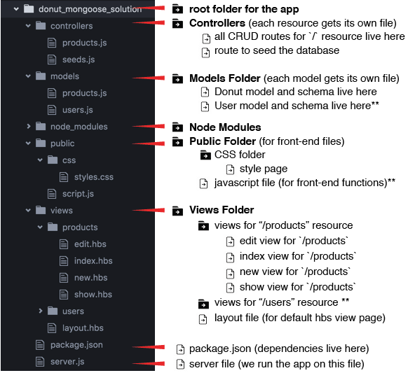

# The Ultimate Donut Shop with Mongoose


In this assignment, you will create a full CRUD MEHN (Mongo, Express, Handlebars, Node) Donut Shop app! Our app will be linked to a Mongo Database, so you can add, edit, and delete donuts.

## Exercise Objectives
- Gain more practice routes with `express.Router()`
- Get a chance to seed data into our database to populate it
- Use `mongoose` and `mongo` to make CRUD functionality happen
- Gain more practice with Handlebars

## Setup
2. In the `donut_mongoose` directory, go ahead and run `npm install` to install all of the app's dependencies.

3. Run `npm run dev` to start the development server.

<!-- #### App Folder Breakdown:
 -->

## Directions

### Part 1: Hook up the app to a Database

- Your `server.js` file has been mostly set up for you. You still have to set up the listener at the bottom of the file. Follow the prompts and set up your `server.js` 
- In `db/connection` you need to connect to a mongo database. Follow the instructions in the file.
- Test your database is connected by running `node db/connection`. Press ctrl+c to stop once you see that the DB is connected.
- :dart: Git add, git commit -m "successfully created donut_store database"

### Part 2: Building a Schema and Model

<details><summary> :bulb: RECAP: Schema, Why Schemas, Mongoose</summary>

#### What is a Schema?

A schema is a way to organize, ahead of time, what a group of data is going to look like. This can be at various levels of a database depending on what kind of databases you are using.

Mongo, is schema-less on the database level. It doesn't care what the data looks like and will take in virtually anything as long as it's syntactically correct.

#### Why they are Important?

Even when you are using Mongo, an inherently schema-less database, a schema can be very helpful. It helps control what is going into the database so that you can both know what is going into it, and to make validations.

#### Mongoose

This is where mongoose comes in. Instead of making sure everything we are putting into our database makes sense and conforms to some type of structure manually, mongoose allows us to define schemas. Mongoose, in the background, can enforce these schemas (as strictly as you like) in order to make sense of the data going into the database and to allow validation. It provides powerful and simple to use tools to do this.
</details>


Lets design a donut schema using mongoose and then use it to create and eventually query for those donuts.

1. In the `models` directory, you should see Donut.js
2. Inside the file you will build out the Donut schema.
3. Make sure that when you export you export the model by calling `mongoose.model(aruments here)`

To start your schema:

```javascript
const Donut = new Schema({
//write your schema fields here

});
```

Our donut collection will look like this:

``` javascript
{
    name: "Chocolate Donut",
    description: "I am a chocolate donut.",
    img: "http://cdn.phillymag.com/wp-content/uploads/2013/09/donut.png",
    price: 5,
    qty: 99
}
```

- Build a donut **schema** and **model** that matches the object above. Export your model.

<details><summary>... Stuck?</summary>

  - Your Donut schema should look like:

  ```
  const Donut = new mongoose.Schema({
  	  name: String,
      description: String,
      img: String,
      price: Number,
      qty: Number
  });
  ```

- The `models/donuts.js` isn't enough with just the Donut schema. Have you:

  - Checked your syntax? -- CAPITLIZATION counts here.

  - exported your model correctly with `module.exports`? Check your notes for syntax. There is more than 1 way to do this.
</details>

<details><summary>:bulb: Bonus objective: Mongoose Validations</summary>
Go to the Mongoose documentation to learn more about validations and defaults: http://mongoosejs.com/docs/api.html

The name field and description are both required, so make sure that the schema accommodates for that.

</details>


- :dart: Git add, git commit -m "created donut schema"


### Part 3: Seed some Donut Data with Mongoose

There is a seed file for you in `db/seeds.js`. To populate some data to your database so we can see something on our app, do the following:

- In your `donut_mongoose` directory run `node db/seeds.js`
- You can confirm in your Mongo DB these items are there in the `mongo` terminal:
  - `show dbs` to view all databases
  - `use the-donut-shop` to use our database for this app
  - `show collections` to see our donut collection
  - `db.donuts.find()` to view all your pretty new donuts
- :dart: Git add, git commit -m "successfully seeded Donut data"

<details><summary>:shit: Oh no! I messed up..</summary>
- Each time you run `node db/seeds` you will seed those donut objects. Doing this more than 1x may duplicate your items.

- If you want to drop your donut collection, in the terminal tab that has mongo open enter:
  - `show dbs` to view all databases
  - `use donut_store` to use our database for this app
  - `show collections` to see our donut collection
  - `db.donuts.drop()` to delete **all** of your donut records
- To re-populate your database, you will have to run `node db/seeds` again.
</details>

### Part 4 and 5: Set Up and Test your Routes and Controllers

In `controllers/donuts.js`, follow the prompts to build your routes and controllers. You will be using Mongoose to make queries to our database.  It is highly recommended to go through and solve one route at a time.

i.e. Create a route for "/", build the donutController index action, then build the index.hbs.  Once you finish those three steps go back to routes and start on GET '/:id'

1. Set up your requirements. **DON'T FORGET** to module.exports the router at the bottom.
2. Create a GET index route "/" that sends all donuts to index.hbs
3. Create a GET show route "/:id" that renders the donut's show page
4. Create a GET new route "/new" that renders the new.hbs form
5. Create a POST index route "/" that creates a new donut and upon success redirects back to the index page
6. Create a GET edit route "/:id/edit" that renders the edit.hbs page and sends that donut's data to it
7. *STRETCH* Create a PUT update route "/:id" that updates the donut and redirects back to the SHOW PAGE (not index)
8. *STRETCH* Create a DELETE delete route "/:id" that deletes the donut and redirects back to index page "/"

For numbers 7 and 8, you will need the npm package `method-override`.

- :dart: Git add, git commit after each route

#### Testing Your Routes

If you don't want to mess with views just yet, you can test your routes and data manipulation with Postman.

Refer to your notes, but be **very mindful** about how you test the routes. Ask yourself:
  - What HTTP verb am I testing? GET, POST, PUT, etc?
  - Which route am I testing? `localhost:3000/`, `localhost:3000/some_id_number`, `/new`, etc.
  - When sending data, make sure you're on the Body tab and you have `x-www-form-urlencoded` selected
  - If there are errors, make sure you route syntax is correct.
  - Debugging tips: use `morgan` to track what requests are coming in. Also write logs in your routes before the mongoose query like console.log("NEW ROUTE WAS ACCESSED") so you can also see the route was hit. If you don't see the console log, check that your syntax matches.


### Part 6: Complete your Views

Your views are mostly built out for you. Your job is to replace the `<<<< >>>>` with the correct handlebar syntax and/or form syntax. Note that if you change the HTML, it may look wonky because the CSS is set up very specifically.

For example:
```
<div class="donut-container">
  <<<< DONUT IMAGE HERE >>>>
</div>
```

... may look something like:
```
<div class="donut-container">
  
</div>
```

- In general your **INDEX** page should:
  - display all the donuts
  - the images link to the donut's show page
  - have a link to add a new donut

- In general your **SHOW** page should:
  - display a product image
  - a link back to the products
  - a link to edit the product (goes to the edit page)
  - a delete button that deletes
  - and the number of items remaining in stock.

- :dart: Git add, git commit after each view


### Reach Goals

1. There will be a BUY button on the donut's SHOW page. The BUY button will reduce the number of items in stock by 1 each time it's pressed. The quantity will update every time you buy a donut.
  - What route should the BUY request go to?
  - Since it updates the product, should it go to a PUT route?
  - Do you need to send any data through to the route?
  - Can you edit the qty value just in the route? product.qty -= 1?
  - Will you have to product.save() if you do this?
  - Should you use the already-existing PUT route, or can you make another?
  - Just get it to work.

### *PRESIDENTIAL REACH GOAL*

-  Make *another* model, this time for a User. The User will have:

  ```
  username: String,
  shopping_cart: Array
  ```

- On the product **show** page, when a user presses `BUY`, the product will be added to the User's shopping cart.
- View the shopping cart on the User's **show** page. (The User will need only a show page and none of the other routes).
- To get more advanced with multiple models that reference each other, look up `references`, this will give you a head start for next week.

## Submitting Your Work

  When you're ready to submit your work,

  1.  Add, commit, and push your code to a new repo.
  2.  Submit your Github link to GA-Grader

  The submission should include:

  -   A link that points back to your repo.

  -   A 'comfort' score on how you feel about the material, from 1 (very
      uncomfortable) to 5 (very comfortable)
