# Intro to Git

## Learning Objectives

- Define version control and identify what problems it solves for developers
- Define a repository (aka repo) and identify the parts of a repo
- Differentiate between a local repository and a remote repository
- Synchronize a local repository with a remote repository using git with Github
- Describe forking and making a pull request

## Framing (5 min / 0:05)

Git is one of a couple tools that you will end up using every day as a
developer; it's an essential component to every developer's work. So what is it?

Git is a version control tool: it keeps track of changes across a collection of
files for us. When we use Git, we can see what changes we made and seamlessly
merge them with changes from our coworkers.

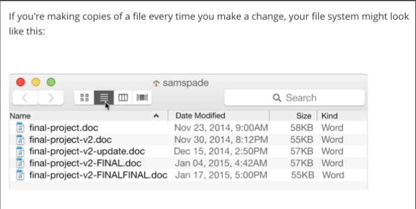
## Version Control (20 min / 0:25)

Simply put, version control is a way of tracking *changes* made to a file or
group of files over time.

Git is a version control system. There are others, like Mercurial and SVN, but
Git is the most popular and the most powerful. Git will track changes made to a
group of files in a directory. Git users like ourselves can **commit** or save
our changes and have access to a history of all the saves or **commits** that we
have made.

### Think, Pair, Share

> 5 min exercise, 5 min review

Turn to the person next to you and discuss the questions below. After 5 minutes,
we'll go over responses as a class.

- Why might we want to have different versions of a file?
- What strategies have you used to keep track of changes you've made to a
  document or file before? If you haven't, brainstorm ways you might keep track
  of different versions of a file/document.
- How well did that strategy work? Was it painful? Can you see any limitations
  or problems associated with that strategy?
- How might that approach work in a team environment?

### Follow Up

If you've worked with track changes in Microsoft Word, then you're familiar with
part of what Git does. Track changes will track any changes (inserted text,
deleted text, etc) to a document. Git can show *differences* between the current
version and the previous version in something called a `diff` (command: `git
diff`). A `diff` will show what has been added in green text or highlighting,
while displaying the things removed in red.

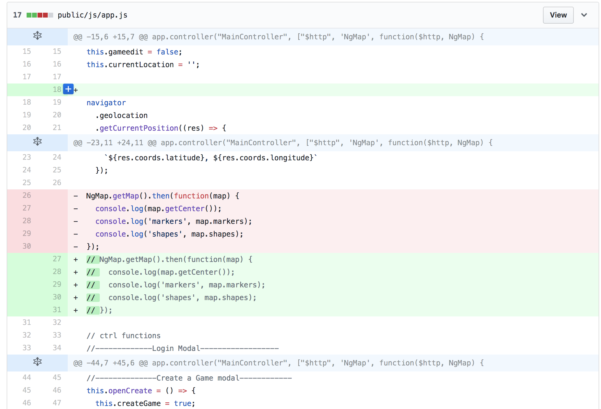

Git does this and a lot more. For example, if you and your coworker are writing
a memo in Microsoft Word and using track changes, how do you keep track of which
version is the final version (yours or your coworker's)? One common solution to
this is to make a copy of the memo and add your initials to the file name, along
with the date and time so you can keep track of different versions of the memo.
Someone then has to manually add any changes you make to their version, or vice
versa.

Imagine if we had to do something like that with a codebase. The codebase for
even a simple web application can be many files - it would take forever and be
extremely error prone!

This is the problem Git solves for developers.

Here's a short list of things you can do with Git:

- track changes to a set of files over time (version control)
- save your work with descriptive save messages (commits)
- track multiple versions and histories of the same codebase (branching)
- merge branches together to combine multiple developer's efforts

## How To Work with Git (10 min / 0:35)

The basics of working with Git could be somewhat familiar to you. Git works
inside of a **repository**: a folder where Git is watching and tracking changes
to files. When we want to record or **commit** some changes we've made and 'save
our progress so far, we do so by **staging** those changes and then
**committing** them.

A **repository** is like a special kind of filing cabinet that stores a bunch of
snapshots of a project taken at different points the project's development. It
contains all of a project's **branches**, each of which are composed of
**commits** representing individual changes to a project over time. As such, a
**repository** encompasses all of the different versions of a project and their
development histories.

"Saving" our work with Git involves two steps: staging some changes and the
committing them. Each commit is like a "save-point" that, collectively, track
the version of our project at a given point in time. Each commit has a commit
message that describes the changes made to a file or group of files. Commits get
stored together in a repository.

For every feature you add, even a very small one, you should make a commit. If
you go an hour without committing, it's usually best to go ahead and commit what
you have gotten to work in the last hour. Your mileage may vary, but it's
probably best to commit every 20-45 minutes.

**Commit Early, Commit Often!**

At any given time, we can go back to the version of our project at any given
**commit**. This ability gives us a lot of room to experiment. It's *absolutely
essential* to have this kind of safety net as a developer!

When collaborating on a project with other developers, Git gives us tools to
create our own "area" for writing code, within that project. This "area" is
called a **branch**. A **branch** is a sequence of commits that represents a
version of our project. All Git repositories start with at least one branch
(`master`).

### Exercise 1: Creating a Repository and Committing - We Do (5 min / 0:40)

1. Create a new `sample_portfolio` folder in your sandbox directory.
2. Change your working directory to `sample_portfolio`.
3. Initialize a git repository in the `sample_portfolio` folder. (`git init`)
4. Create a `index.html` file and write anything in it.
5. Check your status to see what changed - `git status`
5. Add `index.html` to the staging area and then make a commit.

[What makes a great commit
message?](http://tbaggery.com/2008/04/19/a-note-about-git-commit-messages.html)

### What did we just do? (10 min / 0:50)

We've now created a new Git repository, done some work on a project and saved
that work with Git! Let's recap:

**Creating a New Repo:**

The command for creating a new repo is `git init` (to *initialize* a new repo.
This command creates a `.git` directory where Git will track and manages all the
changes to the files in this directory.

You want to be careful where you run `git init`. You only want to run that
command in a folder where you want to create a new repository. If you
accidentally run it somewhere else, can you delete the repository by removing
the `.git` directory (using `rm -rf`).

**Saving Our Work:**

Saving our work in Git requires two steps: Adding changes to the **staging
area** (`git add path/to/filename.js`) and then **committing** (`git commit -m "description of changes"`) those changes.

The **staging area** is one of Git's more unique features, and it can take some
time to wrap your head around it. It helps to think of the **staging area** as a
buffer between the working directory and the project history.
> [Why stage files?](http://gitolite.com/uses-of-index.html)

Instead of automatically committing all of the changes you've made since the
last commit, the **staging area** lets you group *related changes* into highly
focused snapshots before actually committing to the project history. This means
you can make all sorts of edits to unrelated files, then go back and split them
up into logical commits by adding related changes to the stage and commit them
piece-by-piece

Here's another way to think about it...


### Exercise 1.5: More Commits / History - You Do (5 min / 0:55)

1. Modify `index.html`
2. Add your changes to the staging area and create a new commit with an
   appropriate message.
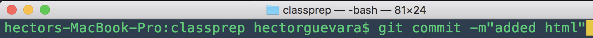

3. Create a new html file and stage and commit.
4. View the **commit history** by running `git log` to see the log of commits,
   and what changed each commit changed.
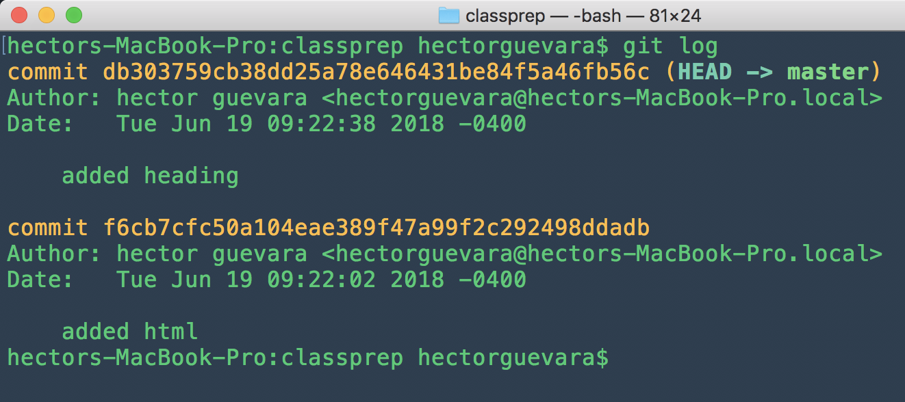


> TROUBLESHOOTING: If you've initialized the git repository in your sandbox
>directory instead of the sample_portfolio folder, try running:
>
>`rm -rf .git`
>
>MAKE SURE YOU DON'T FORGET `.git` IF YOU DO THIS

## Break (10 min / 1:05)

## Using Git to Work with Others (20 min / 1:25)

Git works really well as a version control tool but where it really shines is as
a tool for collaboration (in combination with GitHub).

For the next couple of minutes, we're going to walk through a couple of
scenarios and explain how Git and GitHub can help solve these scenarios.

### Scenario 1

You have this awesome app idea, one that will definitely take off and become one
of those "unicorn" apps worth billions and billions. You jump straight in to
development and start working on the MVP on your laptop. You work through the
night and get really far on your MVP, maybe 85% complete.

The next morning, you hop on your bike to come in to class so you can show your
classmates and get their feedback. But on your bike ride in, you slip and fall!
You are totally fine and uninjured. But you didn't realize your backpack was
open and when you fell your laptop slide out, straight down a sewer drain! What
can you do? You call 311 and the person on the phone tells you they don't
respond to lost item calls.

**How can Git and GitHub help?**

GitHub complements Git by storing versions of a `git` repository on it servers,
**remotely**. GitHub manages access to repositories and also provides many
different services for interacting with repositories on GitHub. Repositories are
associated with GitHub accounts, like yours.

You can create a remote repository in GitHub, link the remote with your
**local** version using `git remote` commands like `add`, `set-url`, and
`remove`. After that link is established, you are able to **push** changes from
your local repository up to your remote repository on your GitHub account.

### Scenario 2

Your friend lends you their laptop and you completely rebuild your MVP from
scratch. This time however, you create a remote repository in GitHub to save
your work there. You finish your MVP and go talk to a bunch of investors. One of
them gives you a million dollars to finish building it out! 🤑 You decide hire
all your SEI classmates to help you finish the app and take it to market.

After you figure out what features you want your classmates to build, one of
them asks how they can start working on the codebase. You have the code on your
laptop and on GitHub. How can your classmate (now coworker) get the code?

Since you're so flush with investor cash now, your first thought is to go and
buy a bunch of fancy USB sticks with your company logo on them. Then, you can
copy the codebase from your laptop on to each USB stick. It's a flawless idea!

**How can Git and GitHub help?**

USB sticks are a terrible idea.

GitHub is a tool for collaborating with other developers. Don't buy USB sticks,
add your classmates as collaborators on the repository on GitHub. Then, they'll
be able to **clone** the repository down to their laptops and **push** their
changes back up. When you need work from one of your coworkers, you can easily
**pull** it.

### Scenario 3

The deadline you set with your investors is fast approaching and you still have
a lot of work on your app that needs to be finished. It's time to hire some
contractors to help push your app over the finish line!

You don't want to give the contractors privileged access to your app and you
want some way to review their work before it gets merged into the final
codebase. Maybe they should get the USB sticks?

**How can Git and GitHub help?**

USB sticks are still a terrible idea.

GitHub works well for all kinds of collaboration. Later in the course, we'll
have an entire class dedicated to different collaboration workflows with GitHub.

What you want is for your contractors to **fork** your repository on GitHub:
make a copy of the codebase that they own and control. They can make all the
changes they need to, then ask for their work to be merged back into the
original repository by making a **pull request**. You or one of your coworkers
can review their pull request and **merge** it if everything looks good.

<!-- ### Scenario 4

You have finished building the feature you've set out to build. Now, your
contractors have made their forks and are off finishing their own work.

You finish it up, push it to GitHub and then throw your hands up in the air.
Eureka! You're finished. Time for a celebratory cup of coffee.

On your way to the gourmet coffee bar you bought with all that investor money,
you get a call from one of the contractors. They need the work you just finished
to make sure that their code works with yours.

They don't want it on a USB stick.

**How can Git and GitHub help?**

When your contractors fork the repository, they'll have a remote copy under
their GitHub. They can clone that down and have a local and remote version of
the repository of their own: their local is the copy on their laptop, their
remote is the copy under their GitHub account (their fork).

Your recent work, however, is in the original repository. The original
repository is the **upstream** repository for you contractors. You can set
multiple remotes for a local repository, provided they are based off the same
original repository. So your contractors just have to set the original
repository as the upstream repository for their local repository and they'll be
able to pull changes from it (but not push changes to it). -->

### Conclusion

Your contractors finish up their work and you merge all their pull requests. You
deploy the app and send the link to your investors.

Your investors are totally blown away by all the hard work you put in to
building the app, congratulations!

## We Do: Git and GitHub (5 min / 1:25)

We need a name for our startup (and repository). Head to
[Namium](http://www.naminum.com/random) for some randomly generated startup
names.

### Creating your own remote repo (10 min / 1:35)

> This relates to **Scenario 1** from above

In this section, we'll learn to push changes made **locally** to our **remote**
repo, hosted on our GitHub account.

#### How to Create a Remote Repository

1. Go to [GitHub](https://github.com)
2. In the top-right corner of the dashboard, you'll see a plus sign (**+**)
3. Click on the plus sign and then on "New repository" from the dropdown menu              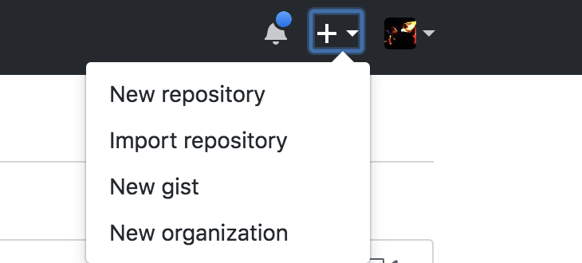

4. Fill in the form for creating a new repo
  - You'll want to give it a name (something descriptive and memorable)
  - You'll generally want to keep the code public (especially for homework, labs
    and projects so your instructors can grade them)
  - You want to leave the checkbox that says "Initialize this repository with a
    README" **unchecked**
5. Hit the "Create repository" button

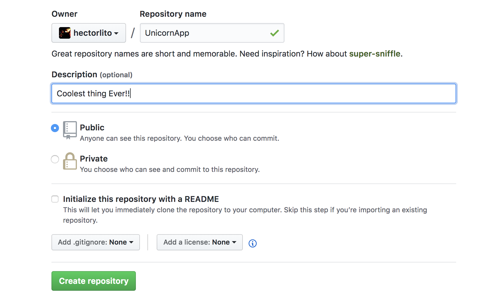


### Exercise 2: Publish to a remote repository on Github (15 min / 1:50)

> This relates to **Scenario 1** from above

The first step is to make sure you have SSH keys set up with GitHub so you don't
have to type your password each time you want to push code. Generally speaking,
SSH keys allows you to connect to a server without remembering a password.

To check whether you have SSH access set up with GitHub / GHE, run these two
commands (don't include the `$`):

```sh
$ ssh -T git@github.com
$ ssh -T git@git.generalassemb.ly
```

If you are already set up, you should see a response like:

```sh
"Hi <username>! You've successfully authenticated, but GitHub does not provide shell access."
```

If you get `Permission Denied`, get help from the support instructor and
reference [this
lesson](https://git.generalassemb.ly/dc-wdi-fundamentals/git-ssh).

**How to publish to a remote repository on Github**

1. Make a new directory inside your `sandbox/` directory with the same name as
   your remote repository you created on github.
2. Create an `index.html` file and "save" it (add and commit).
3. Ensure you have at least one commit (`git log` to verify)
4. Follow the steps provided to add repo as a remote and push your local commits
   to the remote repository
  - NOTE: there are 3 options for setting up your repo. take a second to think
    about which commands you need here
  - Hint: Does the repository on your LOCAL system already exist?
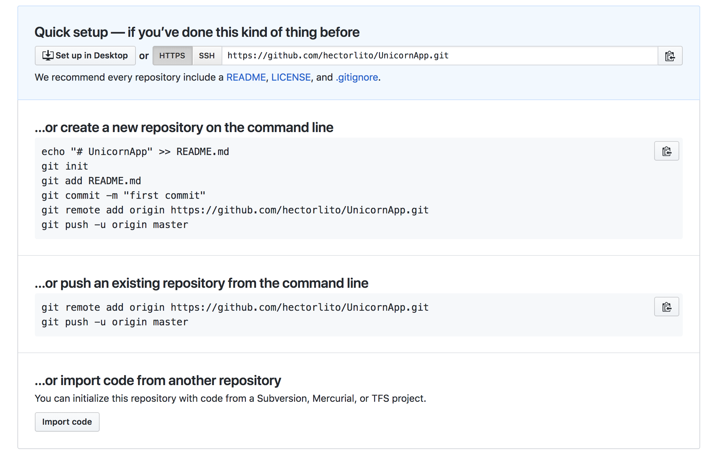

5. Open the repo on GitHub and explore the code there
6. Make a change locally, commit it, and push it
7. Open the repo on Github, and note that the changes have synced (you may have
   to refresh)

## Break (10 min / 2:00)

### Forking (10 min / 2:10)

> This relates to **Scenario 3** from above and is generally how you will submit
> your homework

Pair up with your neighbor or the person behind you (Only pair up with 1 other
person. If there is an odd number of students, someone can pair up with the
instructor as a demo).

#### How to fork a repository

1. Send your partner the link on GitHub to your repository (They should send you
   theirs)
2. In the top right, below the plus-sign we used to create a new repository,
   there is a "Fork" button - click it.
    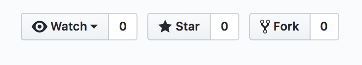

3. A modal *may* pop up with the title, "Where should we fork this repository?".
   If it does, click on your github.com username (not the enterprise github, if they're different).
4. If everything works, you'll see a screen that has a book with a fork in it
   being scanned.
5. You'll then be went to a page that looks like the one you were just on for
   your own repo. Take a close look at the heading in the top left: it should
   have your username and then the name of the repository and underneath that
   something like, "forked from
   <your_partners_uesername>/<the_name_of_the_repo>"

   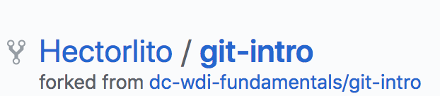


### Cloning (10 min / 2:20)

> This relates to **Scenario 3** from above and is generally how you will submit
> your homework

Now that you've forked your partner's repository, you need some way to get it on
to your computer (locally). This process is called **cloning**

#### How to clone a repository

1. From the repo page for the fork of your partner's repository (where we left
   off in the previous step), find the green button that says "Clone or
   Download".
2. Copy the link by highlighting it and hitting cmd + C or clicking on the
   clipboard button next to the link.
    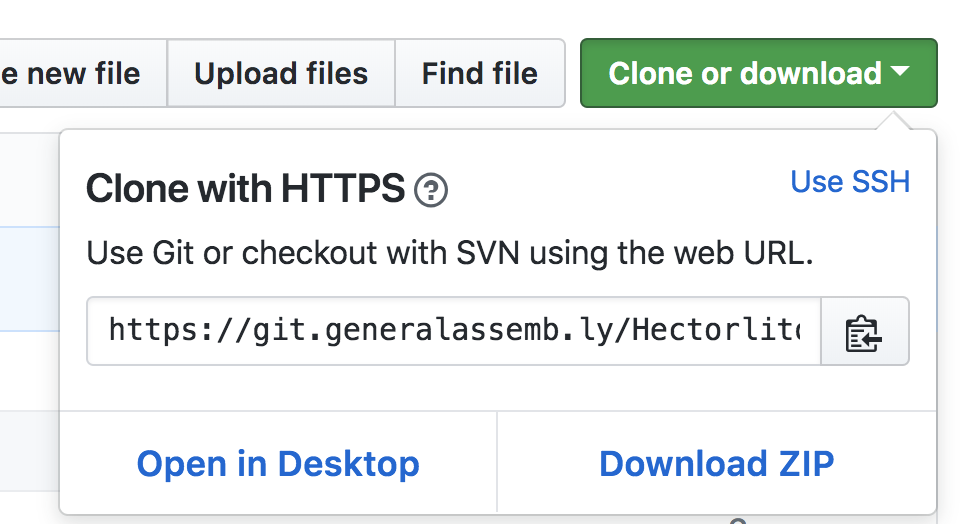

3. Open up a new terminal window and navigate to your sandbox directory
4. The command to clone a repository with git is `git clone
   <url_for_the_repo_you_want_to_clone>`. You can optionally pass in a name for
   the repository if you would like to name the working directory when you clone
   - don't worry about that right now though.
5. Change in to your new directory and run `git log` to see the commit history.
6. Run `git remote -v`. What do you get back? What is interesting about these
   links?

### Pull Requests (10 min / 2:30)

> This relates to **Scenario 3** from above and is generally how you will submit
> your homework

Now that you've cloned your partner's repo, go a head and make a change to what
ever file(s) they have. Stage and commit your work and then push it to the
remote.

Where did we just push our changes to, our partner's repository on GitHub or our
own?

If we want to contribute our work back to the original project, we need to do so
with a **pull request**

#### How to make a pull request

1. Push your work if you haven't already
2. There are a couple of ways to make a new pull request:

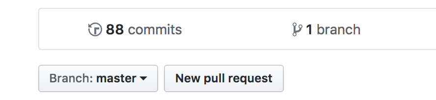
  - From your fork, find and click the "New pull request" button (this is the
    fastest/easiest). This will take you to a new page with a "Create Pull
    Request" button.
  - From the original repository, click on the Pull requests tab and then click
    the New Pull Request button. Click on the "compare across forks" link, find
    your fork in the 3rd dropdown. Then click the "Create Pull Request" button.

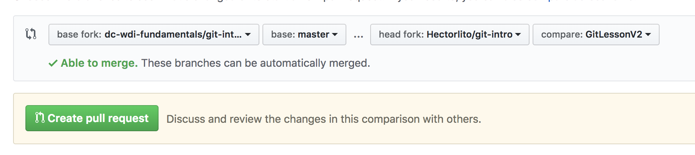
3. Give your pull request a title and a description. If this is a homework
   assignment, you should add your comfort level and completeness in the
   description and the title should include your full name.

## Closing

- Why is version control important for developers?
- What problems do we anticipate using git / github?
- Differentiate between git as a tool, and github as a service
- Define and differentiate between forking and cloning

## Quiz Questions

1. What are the main components of a git repository and how do they relate?
2. Describe the steps of the process for contributing to open source software on
   Github (the same as our homework submission process).

## Homework

### 1. Visit the [haiku](https://git.generalassemb.ly/dc-wdi-fundamentals/haiku) repo and follow the instructions there.

In the comments of the Pull Request description, please include a block like so
(numbers out of 5)...

```
comfort_level: 4
completeness: 5
```

### 2. Read [Understanding git for real by exploring the .git directory(https://medium.freecodecamp.org/understanding-git-for-real-by-exploring-the-git-directory-1e079c15b807)

Optional but highly recommended!

## Resources

- [Become a Git Guru](https://www.atlassian.com/git/tutorials)
- [What makes a great commit
  message?](http://tbaggery.com/2008/04/19/a-note-about-git-commit-messages.html)
- [Interactive Git Cheetsheet](http://ndpsoftware.com/git-cheatsheet.html)
- [Github Guides](https://guides.github.com)
- [Github Training](https://training.github.com/kit/)
- [Git Immersion - Interactive Course](http://gitimmersion.com/lab_05.html)
- [Pro Git](http://git-scm.com/book/en/v2) - An in-depth free PDF book for those
  wanting to understand git deeper
- [GitUp - Interactive Commit Visualizer](http://gitup.co)
- [Practice with Git](https://github.com/grayghostvisuals/practice-git)

## Appendix - Git CLI Commands

### Creating Repositories

- `git init` - run this command in a folder to turn it into a git repository
  - note: don't init a repo inside an existing repo! (also don't init in your
    home folder) OR
- `git clone <URL>` - download (clone) a repo from github (or other remote
  source)

### Linking an existing repo to Github

1. Create the repo on github.com (make sure not to check the 'initialize with
   readme').
2. Follow the instructions on the new repos webpage to add as a remote:
3. Change directories to the local repo
  - `cd ~/path/to/repo`
4. Add the github remote, and name it 'origin':
  - `git remote add origin <URL>`
5. Push the existing commits up to the remote called 'origin' , and set it to
   track master branch:
  - `git push -u origin master`

Once linked, you can just run `git push` to push master branch to master branch

### Committing

1. Add the files you want to commit to the index (equivalent to checking which
   files you want to commit in the Github GUI app)
  - `git add file1 file2 ...`
2. Create the commit:
  - `git commit -m "description message for commit"`
  - if you omit the `-m` and message, then git will open an editor for you to
    write the message in

### Syncing with a remote (push/pull)

1. `git pull [remote] [branch]` - fetch and merge changes (from the origin and
   branch specified) and merge them into the current branch.
  - If origin and branch aren't specified, git will default to the tracking
    branch (usually origin and the remote branch with the same name as the
    current branch).
  - If no origin/branch are specified, and no tracking branch is set up, git may
    tell you to specify
2. 'git push [remote] [branch]' - push and merge local changes from the current
   branch to the specified branch on the remote repo and branch specified.
  - Same rules apply as `git pull` above.
