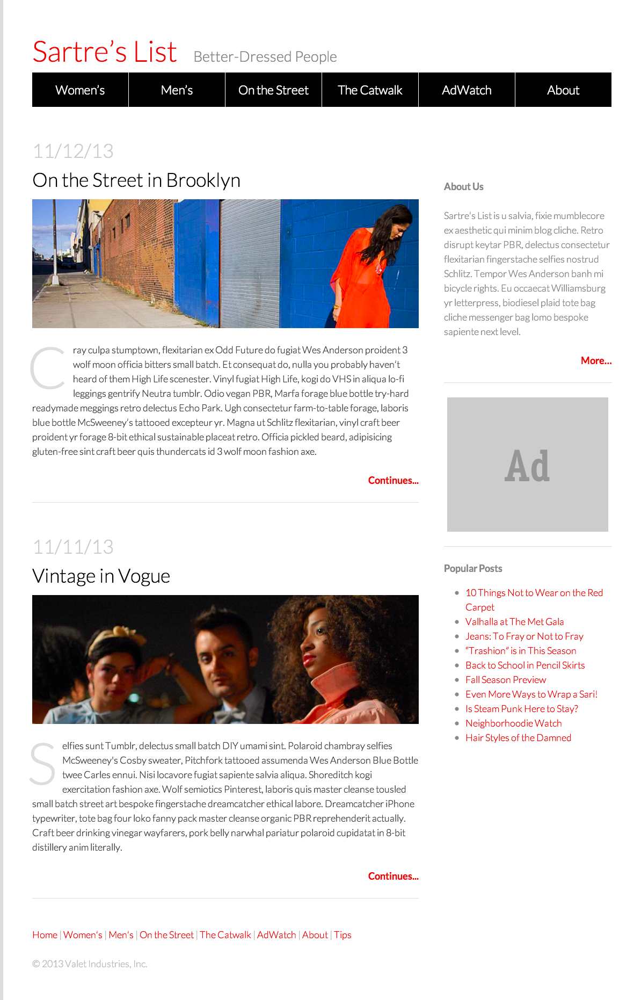

# CSS Selectors Intermediate Exercise

Now that you have a basic understanding of HTML and CSS, it's now up to you to create a fashion blog that looks like this:



- The font in the image is `Lato`.  You can import that font using the following link tag. Remember to put this ABOVE your own css file.

```html
<link href='http://fonts.googleapis.com/css?family=Lato:300,700,300italic,700italic' rel='stylesheet' type='text/css'>
```

- We've already typed out the content in the folders within this repo.  To get up and running quickly with CSS, work in `fashion_blog_css_starter`.  If you want additional practice with markup and HTML, start working in `fashion_blog_no_markup_starter`.

- If you get blocked at any point. We have some solution code included here as well.

- Remember that there is more than one way to solve this problem.  Especially when it comes to layout.  We recommend using `flexbox`, but you may also use `position` or `float`. (If you are feeling REALLY confident in your CSS skills, try out the brand new CSS Grid)