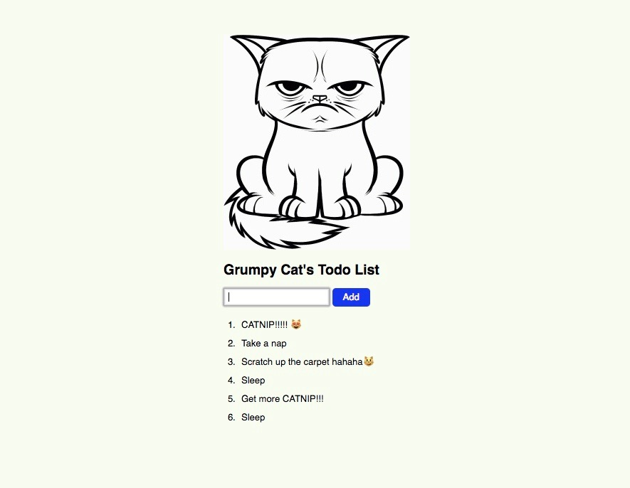

# Welcome to the jQuery 'ToDo List' Lab

## Objectives

By the end of this, students should be able to:

- Structure a jquery app to manipulate DOM elements.
- Append items to a list.
- Modify the status of items in a list - *Bonus🏆*.
- Remove Items on a list - *Bonus🏆*.
- Persist Items to ```localStorage``` - *Bonus🏆*.
<hr>

## Here's a basic example of what we'll be building today 😺




## Grab your starter code [here](./Starter-Code), and let's get started!

## Instructions

1. Create a single page todo app, where you can add items to a list (things to do). Everything should go away if the page is refreshed.
2. Besides jQuery, your project will rely on the basic use of forms, [here's](https://developer.mozilla.org/en-US/docs/Learn/HTML/Forms/Your_first_HTML_form) some useful documentation for your to check out.
3. Think of ways you could target your form with jQuery, how can you grab text inputted from the user? 🤔
4. Consider using event listeners that respond to user-triggered events such as a ```.click()```, ```.dblclick()```, or a keypress like ```enter```.
5. jQuery has some of the best documentation on the web. Check it out [here](http://jquery.com/) 🌎 .
6. Be sure to test your jQuery logic in steps with ```console.log()```, you'll detect faults faster this way💡.
7. Keep in mind that getting stuck is part of the process, work in pairs to find a solution and innovate your way to success. 
8. When in doubt, use Slack! 😅


<hr>

## 🏆 Bonus Section 🏆

#### Congratulations for getting this far, now that you're able to interact with the DOM with jQuery, let's add these features...

- Add functionality that allows you to mark each item on the list as complete, and/or be deleted from the list. 
- Create a way to edit the name/text of a todo item when you click on it.
- Use the provided ```style.css``` file to add some styling to the page.
- Add an image to your page like the example shown above.
