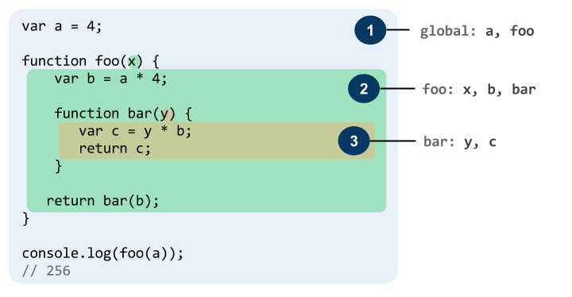

# Functions and Scope

## Learning Objectives

- Give 2 reasons that you may need to use functions

- Write a function definition without parameters
- Write a function definition with parameters
- Write a function definition with default parameters

- Invoke a function without parameters
- Invoke a function with parameters

- Define scope
- Modify a variable outside the scope of a function

- Write an a multiline arrow function definition
- Write an a single arrow function definition without braces

- Define hoisting

## Functions

**What is a Function?**

- Fundamental component of JavaScript
- A reusable block of JavaScript code used to perform a task
- Simply put, a function is a block of code that takes an input,
  processes that input and then produces some form of output

---

**Why do we use functions?**

Benefits of functions:

- Reusability
- DRYness
- Naming convention (describes intent)

---

### Recognize the Parts (20 min / 0:25)

**What are the components of a function?**

#### Function Container

```js
function multiply() {}
```

#### Input Parameters (or Arguments)

```js
function multiply(num1, num2) {
  // now you have two variables you can access
  // num1 and num2
}
```

> When we declare a function that takes input values, we call these
> values parameters.

> Conversely, when we _call_ a function and pass values into it, those
> values are called arguments.

> These terms are often used interchangeably, which is okay. But knowing
> the difference can come in handy.

#### Default/Optional Parameters

Default parameters were introduced in ES6. They allow us to define
parameters that will default to some pre-determined value if the
function is called without passing them in. We can set optional
parameters in a function definition by assigning a value to the
parameter definition.

```js
function exponentiate (base, exponent = 2) {
  return base ** exponent
}

exponentiate(4, 3)
=> 64

exponentiate(4)
=> 16
```

#### Output and Side Effects

```js
function multiply(num1, num2) {
  return num1 * num2; // Output
}
```

- Output: What the function evaluates to - noted by keyword `return`

> If a function returns a value, you can store that value in a variable.

```js
let num2 = 5;

function multiply(num1) {
  num2 = num1 * num2; // side effect
}
```

- Side Effects: Effects the function has on data outside of itself
  (external to its scope)

> Note: If you don’t specify a return value, it will return `undefined`.

#### More on returns

Understanding what `return` means in a function can be a little tricky.

Here are two similar code snippets - can you explain what the difference
is?

```js
let splitMe = 'I am the eggman I am the walrus';

function splitString(str) {
  return str.split(' ');
}

let newString = splitString(splitMe);

console.log(newString);
```

```js
let splitMe = 'I am the eggman I am the walrus';

function splitString() {
  splitMe = splitMe.split(' ');
}

splitString();

console.log(splitMe);
```

What does the first one do? What does the second one do?

Are there advantages to doing it the first way? What about the second
way? Which one seems easier to understand?

### You do: Write some functions (15 min / 0:40)

Open your code editor and spend 15 minutes writing some code and getting
a feel for functions. Try and work through all of these, but at the very
least do 1 from each category.

These functions should all return something. Each should:

- Take a string as an input and reverse it and return it
- Take a number as a parameter and return itself squared.
- Have 3 optional parameters, allnumbers. Add all the numbers together. If the function is called without passing any numbers in, simply return 10.
- Take a number and add some amount of zeroes to the end, returning it (make sure you return a number, not a string)
- return a function (yes you can write functions inside functions\!)

Also, write some functions with side effects.

- Declare a variable, assigning a string to it. Then write a function that modifies that string without returning anything.
- Declare a variable, assigning an array to it. Then write a function that removes the first item from the
  array.

Lastly:

- Write two functions that do the same thing, but one returns
  the value and the other modifies a variable with side effects.
- The functions should both add the string “flabbergasted” on to the end of an array

### Calling vs Referencing a Function

Let’s say we’ve defined a function. Now we need to call it…

```js
// Call a function, passing 2 arguments in
multiply(2, 5);

// Reference the function. What happens if we reference the function without parentheses?
multiply;
```

> When you pass a function into another function as a parameter, do you
> call it or reference it?

### Function Declarations and Expressions (10 min / 0:50)

There are two ways to define a function…

#### Declaration

```js
function multiply(num1, num2) {
  return num1 * num2;
}
```

#### Expression

```js
let multiply = function(num1, num2) {
  return num1 * num2;
};
```

#### Declarations vs. Expressions

Calling them is the same regardless of how they’re declared.

```js
multiply(2, 5);
```

Both do the same thing and run the same chunk of code but they are
different.

**What differences do you notice?**

- **Function declarations** define functions without assigning them to
  variables.
- **Function expressions** assign _anonymous functions_ to variables.

While we call/reference functions defined through declarations and
expressions the same way, they do have a subtle but important
difference…

### Hoisting (10 min / 1:00)

Function declarations are processed before any code is executed, meaning
you can call functions before they are declared in the flow of your
code. This behavior is known as **hoisting**.

Conversely, function expressions **are not** hoisted, meaning you cannot
call them before they are defined in the flow of your code.

What do you think will happen when we run the below code…

```js
multiply(3, 5);
let multiply = function(num1, num2) {
  return num1 * num2;
};
// function expression
```

Surely the same thing will happen when we run the below code…

```js
multiply(3, 5);
function multiply(num1, num2) {
  return num1 * num2;
}
// function declaration
```

> We can successfully call the multiply function before declaring it.
> When our script file loads, the browser processes all function
> declarations first, and then runs the rest of our JavaScript from top
> to bottom.

Knowing this, what will happen each time we call `express` and `declare`
in the below example?

```js
express(); // What happens when we run this function at this point in the code?

let express = function() {
  console.log('Function expression called.');
};
```

What about when we run this example?

```js
let express = function() {
  console.log('Function expression called.');
};

declare(); // ???
express(); // ???

function declare() {
  console.log('Function declaration called.');
}
```

You can read more about hoisting
[here](https://developer.mozilla.org/en-US/docs/Glossary/Hoisting)

### ES6 Features (10 min / 1:10)

#### Arrow Functions

Following the release of ECMAScript 6 (ES6) in 2015, anonymous functions
can be written as “arrow functions”, a syntax adapted from CoffeeScript.

```js
let multiply = function(num1, num2) {
  // function expression
  return num1 * num2;
};
```

What does this look like in ES6?

```js
const multiply = (num1, num2) => {
  return num1 * num2;
};
```

Or, to simplify it further..

```js
const multiply = (num1, num2) => num1 * num2;
```

Arrow functions with a “concise” function body (no brackets and on one
line) have “implicit return”. This means you can leave out the `return`
keyword and it still returns.

However, this single line return can be faked with parentheses (NOT
CURLY BRACKETS\!)

```js
const multiply = (num1, num2) => num1 * num2;
```

## Break (10 min / 1:20)

## Scope

### What Is Scope? (15 min / 1:35)

**In real life:** Your “scope” is what your eyes can see from wherever
you’re standing.

**In Javascript:** scope is…

- Where a variable can be referenced/used.
- A list of all variables that can be accessed from a given line of
  code.

> Two ways of saying the same thing.

#### Quick Example

Here’s a code snippet that demonstrates some of Javascript’s fundamental
rules of scope…

```js
function getColor() {
  color = 'red';
}

getColor();
console.log(color); // What should we see in the console?
```

Let’s see what happens if we add the `let` keyword…

```js
function getAnotherColor() {
  let anotherColor = 'green';
}

getAnotherColor();
console.log(anotherColor); // What should we see in the console?
```

#### Rules of Scope in JS

In Javascript, there are two types of scope: **global scope** and
**local scope**.

There are four simple rules to remember about scope in JS…

1.  Variables created **without** the `let` or `const` keywords,
    no matter where in a program, are placed in the global scope.
2.  Variables created **with** the `let` or `const` keywords are
    created in the current local scope.
3.  All functions create a new local scope.
4.  The current scope includes all outer (enclosing) scopes.

> One consequence of rule 3 is that variables defined outside of any
> function are inherently global, even if the `let` keyword is used.



Another way to say this…

- **Local variables** defined inside a function cannot be accessed
  from anywhere outside of the function, because the variable is
  defined only within the scope of the function.
- However, a function can access all variables and functions defined
  inside the scope in which it is defined (which includes all outer
  scopes).

### We Do: A More Complex Example (15 min / 1:50)

Let’s walk through this example in two steps…

1. Identify and diagram the scope of each variable.
2. Determine whether each `console.log` will error out or not.

```js
teamName = 'Giraffes'; // What scope is this?
let teamCity = 'Sioux Falls'; // What scope is this?

function playBaseball() {
  console.log('From ' + teamCity + '...'); // Does this work?
  console.log('Welcome the ' + teamName + '!'); // Does this work?

  pitcherName = 'Meg'; // What scope is this?
  let batterName = 'Perry'; // What scope is this?

  console.log(batterName); // Does this work?
  console.log(pitcherName); // Does this work?
}

playBaseball();

console.log(teamCity); // Does this work?
console.log(teamName); // Does this work?

console.log(pitcherName); // Does this work?
console.log(batterName); // Does this work?
```

<details>

<summary><strong>List of scopes for this example…</strong></summary>

> `teamName` - global (no let)  
> `teamCity` - global (not in a function)  
> `pitcherName` - global (no let)  
> `batterName` - local to `playBaseball`

</details>

### More on Hoisting (10 min / 2:00)

#### Functions

A Javascript feature that may impact scope is **hoisting**. This applies
to Javascript functions.

Recall that there are two ways to declare functions in Javascript,
**function declarations** and **function expressions**.

```js
let sayHello = function() {
  console.log('Hello!');
};

function sayHello() {
  console.log('Hello!');
}
```

#### Hoisting Review

<details>

<summary> Which is a function declaration? Which is a function
expression? </summary>

- `let sayHello = function () {}` is a function expression.
  - `function sayHello () {}` is a function declaration.

</details>

<details>

<summary> How does a function declaration differ from a function
expression? </summary>

- A function expression follows the same rules as variable assignment.
  Since the value of the reference is a function, that function is
  only available after the assignment.
  - With a function declaration, no matter where you put it in your
    code, it behaves as if you wrote it as the very first line in
    your code.
  - Aside from that, they are functionally equivalent.

</details>

### You do: Write your own (15 min / 2:15)

> 10 minute exercise. 5 minute review

Write a small piece of code that meets the following requirements.
Identify and put a comment next to each variable identifying its scope.

- Has a global variable
- Has at least 1 variable in each function
- Has at least 1 function with parameters
- The function with parameters should modify that input and return
  something new

Some ideas for inspiration:

- Name scrambler (takes a string name input
  and modifies it in some way)
- Take two numbers and return the square
  root of the difference
- A function that shuffles an array.

### Bonus: Immediately-Invoked Function Expressions

When you are working on larger, more complex applications (particularly
ones with multiple linked scripts), the use of global variables can
cause trouble. Since all global variables are defined on the `window`
object, declaring too many global variables (commonly called “polluting
the global namespace”) increases the risk of variables overwriting each
other and thereby causing errors.

One simple solution for this is to wrap each script’s JavaScript code in
an Immediately-Invoked Function Expression (IIFE). An IIFE is a function
that, when loaded into the browser, immediately invokes itself and
thereby creates a new local scope to enclose all variables within it.

```js
(function() {
  // IIFE

  let username = 'XxXskaterBoi2004XxX';
  let profileID = 4011989;

  function logIn() {
    let sessionID = '8675309';
    let token;
    return decrypt(sessionID);

    function decrypt(string) {
      let token = profileID;
    }
    return token;
  }

  logIn();
})();
```

## \> NOTE: Using an IIFE would prevent you from being able to access variables and functions within it from the console. Therefore, for now, you should refrain from using it.

## Review Questions

1.  What is a functions in javascript and how can they be useful?
2.  How is a side effect different from an output?
3.  What is the difference between calling and referencing a function?
4.  How is a function declaration different than a function expression?
5.  Explain the difference between local and global scope.
6.  Explain how hoisting can affect functions.
7.  Explain how hoisting can affect variables.
8.  What does DRY mean?

## Bonus: Test Your Scope Knowledge

> 10 minutes exercise. 5 minutes review.

Answer the questions below the following code snippet. The letters in
the questions and answer choices reference lines in the snippet.

```js
/* A */
let username = 'XxXskaterBoi2004XxX';
/* B */
function logIn() {
  /* C */
  let sessionID = '8675309';
  /* D */
  return decrypt(sessionID);
  /* E */
  function decrypt(string) {
    /* F */
    let token = profileID;
    /* G */
  }
  /* H */
}
/* I */
logIn();
/* J */
let profileID = 4011989;
/* K */
```

1.  The variable `username` is accessible on which lines? (That is:
    on which lines can it be `console.log`ged without throwing an
    error?)
    - A, B, I, J, K
    - A and B
    - All lines
    - All lines except A
1.  The variable `profileID` is accessible on which lines? 
    - A, B, I, J, K
    - K
    - All lines
    - All lines except A
1.  The variable `sessionID` is accessible on which lines?
    - D, E, F, G, H
    - D, E, H
    - All lines
    - All lines except F and G
1.  The function `decrypt` is accessible on which lines?
    - C, D, E, F, G, H
    - C, D, E, H
    - All lines
    - All lines except F and G

<details>

<summary><strong>When you’ve finished…</strong></summary>

1.  All lines except A. The variable is only available after `username =`
1.  K
1.  All lines.
1.  D, E, F, G, H
1.  C, D, E, F, G, H

</details>

## References

- [Understanding Scope and Context in
  JavaScript](http://ryanmorr.com/understanding-scope-and-context-in-javascript/)
- [Everything you wanted to know about JavaScript
  scope](http://toddmotto.com/everything-you-wanted-to-know-about-javascript-scope/)
