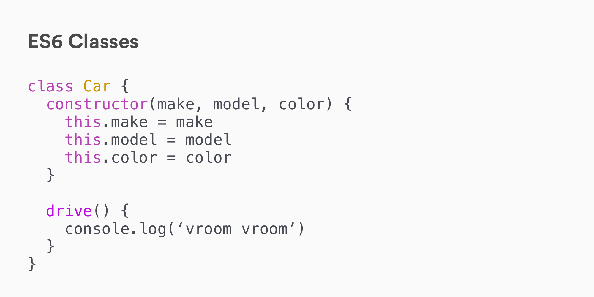

# Object Oriented JavaScript

## Framing (5 min / 1:20)

From our Intro to OOP lesson, we know that we need a way to define a class with
attributes and methods, create instances of that class and then define some way
of creating sub-classes based on a parent class. Let's get to it!

## Getting Started

Follow along to the examples below in [JS OOP
Practice](https://git.generalassemb.ly/dc-wdi-fundamentals/js-oop-practice). The
exercises you will be completing are also in that repository.

## Classes in ES6 (15 min / 1:35)

> Follow along with Prompt #1 in [JS OOP
> Practice](https://git.generalassemb.ly/dc-wdi-fundamentals/js-oop-practice)

We briefly saw how to define a class in the previous section, in comparison to
how we do so in Ruby, Python and PHP. The syntax looks like this:



> The above figure shows how to define a simple class using JavaScript. The
> Class is defined using the `class` keyword and given a name (in this case
> `Car`). The `constructor` function accepts three parameters (`make`, `model`,
> and `color`) and sets these as attributes. The class also contains a `drive`
> method.

Notice the use of `this` and the fact that we're not returning from the class?

When we want to generate instances of this class, we'll use the `new` keyword:

```js
const carolla = new Car('Toyota', 'Carolla', 'Grey')
const outback = new Car('Subaru', 'Outback', 'Forest Green')
```

The `new` keyword will automatically:

1. Create a new, empty object for us
2. Generate a context for that object (`this` = the new object)
3. Return the object instance from our class

### You Do: Define an Animal Class (15 min / 1:50)

> 10 min to work, 5 min to share with the class

Work through Prompt #2 in [JS OOP
Practice](https://git.generalassemb.ly/dc-wdi-fundamentals/js-oop-practice)

## Inheritance (15 minutes / 2:05)

The last core concept of OOP we need to implement is inheritance.

> Follow along with Prompt #3 in [JS OOP
> Practice](https://git.generalassemb.ly/dc-wdi-fundamentals/js-oop-practice)

### Turn & Talk (5 min)

Turn to your neighbor or the people in your row and discuss the following
questions:

* What is inheritance?
* What problem does inheritance solve?

### Inheritance in JavaScript

In JavaScript, we can inherit from a class by *extending* it with the `extend`
keyword. This will let us create a subclass:

```js
class Car {
  constructor(make, color) {
    this.make = make
    this.color = color
  }
}

class Toyota extends Car {
  drive() {
    console.log('vroom vroom')
  }
}
```

The above `Toyota` class will include all of the properties defined in the `Car`
class, in addition to the `drive` method.

If we have properties that we want to add to our subclass, we still need to take
in the properties of our parent class, and pass them up to our parent class with
`super`:

```js
class Car {
  constructor(model, color) {
    this.model = model
    this.color = color
  }
}

class Toyota extends Car {
  constructor(model, color) {
    super(model, color)

    this.make = 'Toyota'
  }
  drive() {
    console.log('vroom vroom')
  }
}
```

The `super` method invokes the `constructor` method of the parent (or extended)
class. So in our `Toyota` class, the `super` method will call the `constructor`
method of our `Car` class.

## You Do: Extend an Animal Class (10 min / 2:15)

Work through Prompt #4 in [JS OOP
Practice](https://git.generalassemb.ly/dc-wdi-fundamentals/js-oop-practice)

## You Do: Game of Cards (15 min / 2:30)

Work through Prompt #5 in [JS OOP
Practice](https://git.generalassemb.ly/dc-wdi-fundamentals/js-oop-practice)

