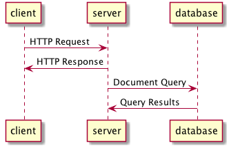
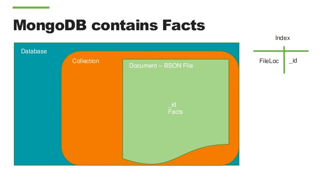

# MongoDB


# Learning Objectives

- Explain why we use a DB 
- Define what a Document-based database is
- Draw and label a diagram showing the 3 parts of a MongoDB

# Framing

Why use a database at all?

What's a major shortcoming of our applications right now, in terms of user
experience?

When we quit or reload the page, any data / progress is lost! Right now, we can
only store information in memory, which is wiped when we quit out of a program.
We need a way to fix this.

Enter databases...



# Databases 

A database is a tool for storing data. There are many ways to store data on a
computer (e.g., writing to a text file, a binary file). Databases, however,
offer a number of advantages...

**Permanence**: Once we write data to our database, we can be pretty sure it
won't be lost (unless the server catches on fire).

**Speed**: Databases are generally optimized to be fast at retrieving and
updating information. Literally, DBs can be 100,000x faster than reading from a
file. This is especially important at scale.

**Consistency**: Databases can enforce rules regarding consistency of data,
especially when handling simultaneous requests to update information.

**Scalability**: Databases can handle lots of requests per second, and many DBs
have ways to scale to massive loads by replicating / syncing information across
multiple DBs.

**Querying**: DBs make it easy to search, sort, filter and combine related data
using a **Query Language**.

**When dealing with less complex associations, non-relational databases can be more
effective**. Mongo provides a more flexible, scalable solution for storing data.

# Terminology

While this is a bit technical, it's worth clarifying some terminology...

Name                        | Description
----------------------------|-------------------------------------------------
Database                    | The actual data being stored.
Database Management System  | The software tools to interact with your data 
Database CLI                | A command line tool to interact with the data

## 3 Parts of Documentbased DB



# Documents

A basic example of a `Person` document:

```json
{
  "name": "Sue",
  "age": 26,
  "status": "Active",
  "groups": ["sass", "express"]
}
```

- a data structure composed of field (key) and value pairs (almost identical to a JS object)
- similar to JSON objects ([JavaScript Object
  Notation](https://www.mongodb.com/json-and-bson) is a JS object converted
  into text to be parsed easily by machines)
- stored as BSON [(binary-encoded JSON)](http://bsonspec.org/)
- must have a field that is a primary key

## Primary Keys

[Primary Key Documentation](http://docs.mongodb.org/manual/reference/glossary/#term-primary-key) 

- A record's unique immutable identifier generated upon creation of a new
  instance.
- In MongoDB, the *_id* field is usually a
  *[BSON](http://docs.mongodb.org/manual/reference/glossary/#term-bson)
  [ObjectId](http://docs.mongodb.org/manual/reference/glossary/#term-objectid)*.

[Documentation Here] (https://docs.mongodb.com/manual/introduction/)

## Example of Document

```json
{
   "_id" : ObjectId("54c955492b7c8eb21818bd09"),
   "address" : {
      "street" : "2 Avenue",
      "zipcode" : "10075",
      "building" : "1480",
      "coord" : [ -73.9557413, 40.7720266 ],
   },
   "borough" : "Manhattan",
   "cuisine" : "Italian",
   "grades" : [
      {
         "date" : ISODate("2014-10-01T00:00:00Z"),
         "grade" : "A",
         "score" : 11
      },
      {
         "date" : ISODate("2014-01-16T00:00:00Z"),
         "grade" : "B",
         "score" : 17
      }
   ],
   "name" : "Vella",
   "restaurant_id" : "41704620"
}
```

## Collections 

A collection is simply a  group of docments. A collection has the following properties:

- used to group documents that have a similiar purpose 
- does **NOT** require its documents to have the same schema (format, shape)

Look up the documentation on Collection in the official MongoDB docs.

## Database

A database is simply a group of collections. A MongoDB server can host multiple databases
where one would typically have database per project or task. 

For this course you will only be using one DB per project.
