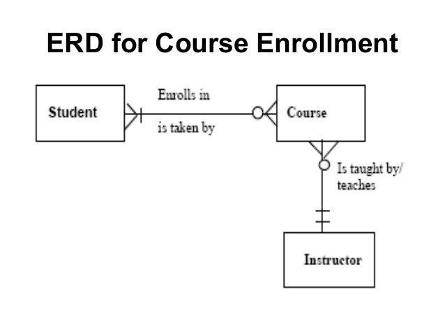

# Data Modeling & Mongoose

## Learning Objectives
* Learn about data modeling
* Understand the M in MVC
* Understand Object Document Mapping (ODM)
* Build models using Mongoose


## Overview (5 min / 0:05)

Today we'll talk about mongoose, an object document mapping (ODM) library for javascript & mongodb. Mongoose plays nicely with express and modern javascript conventions, and has an easy to learn API.

We're also going to build models using mongoose. This will let us easily get data in and out of our database.

Before any of that though, we'll talk about data modeling and how to think about representing your data before you build it.


## Modeling Data (40 min / 0:45)

### What is data modeling?

The short answer is: a way to think about the relationships between pieces of data.

Pieces of data can be anything, but in this case we're going to talk about application data.

### ERDs

ERD stands for entity relationship diagram. It's a visual diagram that shows how pieces of data are connected to each other.

Most commonly these are used to show how `relational` databases are set up. Most databases have some form of relationships, even in mongo which is considered a `nosql` database.

Here's an example ERD.



Note the lines connecting course and student. These have special meanings. You can learn more about those meanings [at this link here](https://www.lucidchart.com/pages/ER-diagram-symbols-and-meaning). Generally, we're only concerned about the relationship lines, not the entities themselves.

When talking about relationships, we generally talk about things in two ways: quantity and ownership.

```
many to one
many to many
one to one

belongs to
```

### We do: Draw some examples

Take a look at these groups of words. Let's see if we can make sense of how they might relate to each other.

For each of these, we'll draw a diagram showing the relationships between them, and label the lines 

```
book
author
```

```
artist
song
album
```

```
make
model
year
color
price
```

For the last one, pair up and draw on your desks or notebooks.

```
user
tweet
comment
```

## Break (10 min / 0:55)

## Mongoose (5 min / 1:00)

### What the heck is mongoose? 

[Mongoose](http://mongoosejs.com/) is an Object Document Mapper (ODM) - a tool we can use to map between native objects and documents stored inside a document store (like MongoDB). In this case, mapping means we are able to interact with the documents in the database by just calling javascript functions, and letting mongoose handle the querying and retrieval.

### Why are we using Mongoose?

ODMs like Mongoose let us connect to a database and then interact with our database in a consistent and easy way. We could just use the MongoDB JavaScript library, but Mongoose gives us an easier way to interact with our database and work with the objects stored in it. It's consistent and has a lot of nice features for querying, so we don't have to write them ourselves.

## Connect to Mongoose (10 min / 1:10)

In order for us to use Mongoose to communicate with our database, we need to link it up to our Express application. We'll do this by...

* Establishing a connection with a Mongo database.
* Defining a Mongoose schema and model.

A schema is a description of how an object should be structured (a *schematic* for objects we want to use in our application and store in our database). A schema is defined as part of a **Model**: a representation of our data in our application (the **M** in **MVC**).

### Set up Connection to MongoDB

1. `cd` into the Chirp project we started in a previous lesson
2. Install Mongoose via the command line: `npm i mongoose`.
3. Create a `db` directory in the root of the project and put a `connection.js` file in it
4. In `connection.js`, require `'mongoose'` and save it to a `mongoose` variable.
5. Connect to our `chirp` database using `mongoose.connect()`.
6. Export this connected version of `mongoose` via `module.exports`.

```js
// db/connection.js
const mongoose = require("mongoose")

mongoose.connect("mongodb://localhost/chirp").then(() => {
  console.log("MONGODB is now connected")
})

module.exports = mongoose;
```

### Planning our models (10 min / 1:20)

Before we actually write any code, we have to think about what we want to build. 

Let's look at our routes file and see if we can derive some meaning from them.

```js
// Application routes
router.get('/', applicationController.index)

// User routes
router.get('/users', userController.index);
router.get('/users/new', userController.new)
router.get('/users/:userId', userController.show)
router.post('/users', userController.create)
router.delete('/users/:userId', userController.delete);

// Chirp routes
router.get('/users/:userId/chirps', chirpController.index);
router.get('/users/:userId/chirps/new', chirpController.new);
router.post('/users/:userId/chirps', chirpController.create);
router.get('/users/:userId/chirps/:chirpId', chirpController.show);
router.get('/users/:userId/chirps/:chirpId/edit', chirpController.edit);
router.put('/users/:userId/chirps/:chirpId', chirpController.update);
router.delete('/users/:userId/chirps/:chirpId', chirpController.delete);
```

Which of these routes represent things we want to keep track of?

Let's think about what properties we can associate with them. Write these down on the board. We'll use them in the next step.

### Schema & Types (5 min / 1:25)

We can think of a Schema as sort of a blueprint for how we want our model to look. We describe its structure, telling it what properties it should have, and what type of data those properties should contain.

Schema's share many of the same properties as classes in JavaScript.  However, when working with Schema, you must use the syntax that Mongoose expects.

Let's pull up the [Mongoose docs](http://mongoosejs.com/docs/schematypes.html), for reference.

Most of these types should look familiar. They map pretty closely to JavaScript's native types.

We use schemas to enforce data consistency. For example, if we set the `name` property to a string but then try to store it as `boolean` it will throw an error and not store that record in the database.

### We do: Defining a Mongoose Schema and Model (20 min / 1:45)

Now let's actually create something.

- Create a new folder called `models` in the root directory of our project.
- Create a file in `models` called `User.js` (note the capital U).
- At the top of `User.js`, require the `connection.js` file and save it to a `mongoose` variable.
- Import `Schema` from `mongoose.Schema`
- Define a `User` schema using mongoose's `.Schema()` method.
- Add whatever properties we decide are necessary.
- Export the schema using `module.exports` and `mongoose.model()`.


Add the following to your `User.js` file:

```js
// models/User.js
const mongoose = require("../db/connection");
const Schema = mongoose.Schema;

// initialize the schema with a configuration object
const User = new Schema({
  // email, password, and chirps are our properties
  email: String,
  password: String,
  chirps: [
    {
      type: Schema.Types.ObjectId,
      ref: "Chirp"
      // ref means reference another model. In this case it's called Chirp
      // We'll come back around to the concept of references in a later lesson.
    }
  ]
});

module.exports = mongoose.model("User", User);
```

Note that when we declare properties, we can write them one of two ways.

```js
{
  email: String
}
```

or 

```js
{
  email: { type: String }
}
```

We use the second example because some of our types [require more than one property](https://mongoosejs.com/docs/schematypes.html). `chirps` is a good example of that.

```js
{
  chirps: [
    {
      type: Schema.Types.ObjectId,
      ref: "Chirp"
    }
}
```

There are some other neat options we can include using mongoose.

For example, on a `String` we can include any of these properties:

```
lowercase: boolean, whether to always call .toLowerCase() on the value
uppercase: boolean, whether to always call .toUpperCase() on the value
trim: boolean, whether to always call .trim() on the value
match: RegExp, creates a validator that checks if the value matches the given regular expression
enum: Array, creates a validator that checks if the value is in the given array.
minlength: Number, creates a validator that checks if the value length is not less than the given number
maxlength: Number, creates a validator that checks if the value length is not greater than the given number
```

So if we wanted to include any of these, we would have to use the `type` format.

```js
{
  email: { 
    type: String,
    lowercase: true,
    trim: true
  }
}

```

Similar for numbers and dates:

```
Number
min: Number, creates a validator that checks if the value is greater than or equal to the given minimum.
max: Number, creates a validator that checks if the value is less than or equal to the given maximum.

Date
min: Date
max: Date
```

The documentation has it all!

https://mongoosejs.com/docs/schematypes.html

## You do: Build the Chirp model (20 min / 2:05 )

> 10 min exercise, 10 min review

Following the same steps as before, build out your chirp model.

> Hint: In this file, you should also include a Comment model and include it as a property of chirp.

<details>
  <summary>
    Solution
  </summary>

```js
const mongoose = require("../db/connection");
const Schema = mongoose.Schema;

const Comment = new Schema({
  content: String,
  createdAt: {
    type: Date,
    default: Date.now()
  },
  author: {
    type: Schema.Types.ObjectId,
    ref: "User"
  }
});

const Chirp = new Schema({
  content: String,
  createdAt: {
    type: Date,
    default: Date.now()
  },
  author: {
    type: Schema.Types.ObjectId,
    ref: "User"
  },
  comments: [Comment]
});

module.exports = {
  Chirp: mongoose.model("Chirp", Chirp),
  Comment: mongoose.model("Comment", Comment)
};
```

</details>

Seed the Database 

We want our database to contain data when we start our application, or when we share it with someone else and have them work on it.

Instead of manually creating Users and Chirps by typing them into the front end, we can set up a seed file that will populate the data with some starter data.

Because we're using mongoose in our project, we can just use the models we've already built to create data for us.

### Set Up Seed File

Here's what we're gonna do:

1. Create a new `seed.js` file in `db`.
2. In `seed.js`, require the files containing our model definition and seedData:
   - Require the `User.js` file and save it to a variable called `User`
   - Require the `Chirp.js` file and save it to a variable called `Chirp`
3. Add a method that hashes our passwords for us (using a library called bcrypt)
4. Write Mongoose queries that accomplish the following...
   - Clears the database of all data, and `.then`...
   - Inserts our seed data into the database, and `.then`...
   - Calls `process.exit()` (which exits the script).

Here's the intitial setup:

```js
const User = require("../models/User")
const { Chirp } = require("../models/Chirp")

User.deleteMany()
  .then(() => {
    return Chirp.deleteMany()
  })
```

Now that we've removed all the data in there, we'll add a user record.

```js
...

User.deleteMany()
  .then(() => {
    return Chirp.deleteMany()
  })
  .then(() => {
    return User.create({
      email: 'bugsbunny@gmail.com',
      password: 'bugsbunny'
    })
  })
```

Alright, we've created the user. Now we want to associate some chirps with that user. To do that, we'll use mongoose's `Promise` feature, which allows us to chain functions using `.then()`

```js
...

User.deleteMany()
  .then(() => {
    return Chirp.deleteMany()
  })
  .then(() => {
    return User.create({
      email: 'bugsbunny@gmail.com',
      password: 'bugsbunny'
    })
  })
  .then(bugs => {
    const chirp1Promise = Chirp.create({
      content: "eh, what's up doc?",
      author: bugs._id
    }).then(chirp => {
      bugs.chirps.push(chirp)
    })

    const chirp2Promise = Chirp.create({
      content: "That's all, folks!",
      author: bugs._id
    }).then(chirp => {
      bugs.chirps.push(chirp)
    })

    return Promise.all([chirp1Promise, chirp2Promise]).then(() => {
      bugs.save()
    })
  })
```

That will create us one User and two chirps. Here's the full seedfile that includes a few more.

<details>
  <summary>
  Seed.js
  </summary>

```js
const User = require('../models/User')
const { Chirp } = require('../models/Chirp')

// Delete all Users that exist in the database
// This cleans up any existing bad test data
User.deleteMany()
  .then(() => {
    // Delete all Chirps that exist in the database
    // This cleans up any existing bad test data
    return Chirp.deleteMany()
  })
  .then(() => {
    // Create our First User
    // This is an example of a Promise, or an asynchronous action.
    // It will take time to complete
    return User.create({
      email: 'bugsbunny@gmail.com',
      password: 'bugsbunny'
    })
  })
  .then(bugs => {
    // Once first user is created, add two chirps
    // The argument 'bugs' is the User AFTER it has successfully been saved to the database.
    const chirp1Promise = Chirp.create({
      content: "eh, what's up doc?",
      author: bugs._id
    }).then(chirp => {
      bugs.chirps.push(chirp)
    })

    const chirp2Promise = Chirp.create({
      content: "That's all, folks!",
      author: bugs._id
    }).then(chirp => {
      bugs.chirps.push(chirp)
    })

    // Promise.all will wait for an array of promises to complete before moving onward.
    return Promise.all([chirp1Promise, chirp2Promise]).then(() => {
      // Once the chirps are saved, we will save our user one more time, since we added 2 ids to the chirps array
      bugs.save()
    })
  })
  .then(() => {

    // Once bugs is created, we'll build out our next seeded User
    return User.create({
      email: 'daffyduck@gmail.com',
      password: 'daffyduck'
    })
  })
  .then(daffy => {
    // Once daffy is saved, create two chirps and save them to the user
    // Notice that this looks almost identical to the previous seeds
    const chirp1Promise = Chirp.create({
      content: "Who's this Duck Dodgers any how?",
      author: daffy._id
    }).then(chirp => {
      daffy.chirps.push(chirp)
    })
    const chirp2Promise = Chirp.create({
      content: "You're dethpicable.",
      author: daffy._id
    }).then(chirp => {
      daffy.chirps.push(chirp)
    })

    return Promise.all([ chirp1Promise, chirp2Promise ]).then(() => {
      daffy.save()
    })
  })
  .then(() => {
    return User.create({
      email: 'elmerfudd@gmail.com',
      password: 'elmerfudd'
    })
  })
  .then(elmer => {
    const chirp1Promise = Chirp.create({
      content: "Shh. Be vewy vewy quiet. I'm hunting wabbits! Huh-huh-huh-huh!",
      author: elmer._id
    }).then(chirp => {
      elmer.chirps.push(chirp)
    })

    const chirp2Promise = Chirp.create({
      content: 'Kiww da wabbit!',
      author: elmer._id
    }).then(chirp => {
      elmer.chirps.push(chirp)
    })

    return Promise.all([ chirp1Promise, chirp2Promise ]).then(() => {
      elmer.save()
    })
  })


```

</details>

### Running the Seed File

1. Run `node db/seed.js` in the terminal.
2. `ctrl-c` after a few seconds to exit out of the process.
3. Then run `mongo` in the terminal and do a `.find()` on your data to verify it's all there!


## Wrapping up

* In User we used a `ref` to reference the `Chirp` model. But in `Chirp` we just directly included `Comment` as a straight up regular property.
  * What's the difference?
* What's the difference between a model and a schema?
* Why are we exporting one thing in User but two things in Chirp? How does that affect how we import them?

So that's it! We've defined our schemas and exported them as models.

In the next lesson we'll use those models to actually create and retrieve data from mongo.

## Checklist

* [A Checklist for Creating a MEHN App](https://git.generalassemb.ly/dc-wdi-node-express/express-checklist)
## Resources

* [Using ES6 Promises Instead of Callbacks for Mongoose Queries](http://erikaybar.name/using-es6-promises-with-mongoosejs-queries/)
* [How to Write Middleware for Express Apps](https://stormpath.com/blog/how-to-write-middleware-for-express-apps)
* [Method Override](https://github.com/expressjs/method-override)
