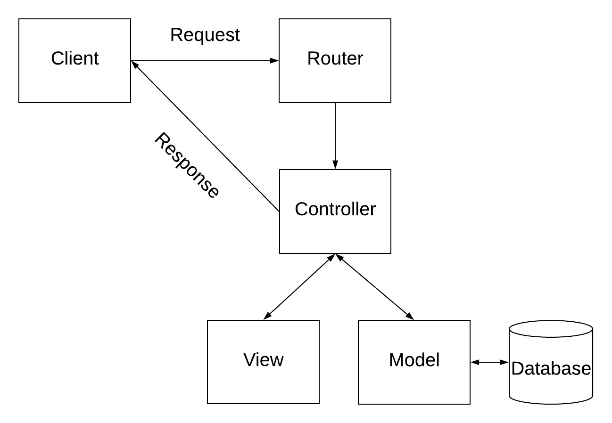
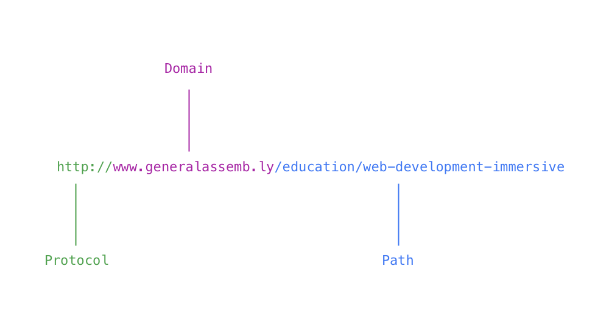

# Express: Routing and Controllers

## Objectives

By the end of this lesson, developers should be able to:

- Give a reason why we neeed single responsibility
- Explain how Routing and Controllers pertain to MVC and rMVC
- Add both routes and controller actions to an Express application

# Single Responsibility

* Define responsibility: "response" and "able"
* Can you say you are a responsibly pet owner if you do not able to respond to
  the pet's needs? No! What causes you to not be able to respond? One is your
  other responsibilities!

https://blog.cleancoder.com/uncle-bob/2014/05/08/SingleReponsibilityPrinciple.html

* Each piece of your code must be responsible for one thing and one thing only

### MVC

The Model-View-Controller pattern is one of the most popular patterns for
structuring web applications. Each of the three parts has a specific function:

1. The **Model** is in charge of our data.
1. The **View** is in charge of presentation.
1. The **Controller** is in charge of tying the two together and sending the server's response.

Express is **not** an MVC framework in the way that Ruby on Rails, Laravel,
ASP.NET, or Sail.js are. We are by no means required to follow the MVC pattern
when building our applications with Express. But patterns like MVC exist for
a reason! They make our lives as developers easier in a number of ways:

1. We (the developers) don't have to figure things out from scratch every time,
1. Other developers can join our project and easily get an idea for how everything works,
1. We can typically be more productive if we're following a pattern.

### MVC and rMVC

rMVC is an important variation on the MVC pattern. The "r" in rMVC stands for
"routing".

What is routing and how does it relate to MVC? A follow up question to that
would be: when our application receives a request from a user, what happens to
it? How do we know it is a request our application can handle? How is the
request processed and the response sent?

The answer to these questions is: routing. Routing determines what requests our
application can respond to, all other requests receive a `404`. Routing also
determines how a request is handled by passing the request on to the appropriate
Controller.

In rMVC, a request comes in to the router, the router figures out which
Controller should handle that request and then the Controller builds and sends
the response (probably by fetching data from the Model and rendering it in
a View):



How will this translate to building applications in Express?

The applications we're going to build in Express are going to roughly follow the
rMVC pattern. At the most basic level, that means the file system for our
applications will look something like this:

```sh
express-app/
	├── controllers/
	├── models/
	├── routes/
	└── views/
```

Our `routes/` directory will hold all of our application routes, which will
accept requests from our users and pass them off to the appropriate Controller
in the `controllers/` directory.

## Review of Routing

So what is routing? What is a route?

> A Route is a path and an HTTP method (verb)

So if you were to navigate to `http://www.google.com` in your browser, the path
would be `/` (the root of the application) and the HTTP method (or verb) would
be `GET`.

If you navigate to `http://www.linkedin.com/in/williamhgates`, the path would be
`/in/williamhgates` and the verb would be `GET`.

Where else have we heard and used the term `path`?

The file system on our computer! It used to be the case (and still can be) that
when you were making request with your browser, you were requesting a file on
the file system of the server. If you had a file system that looked like this:

```sh
.
├── about
│   └── index.html
├── contact
│   └── index.html
└── index.html
```

The homepage would return the root level `index.html` and `/about` would return
`about/index.html`.

We also heard the term `path` when we were talking about URLs:



We call that segment of the URL a `path` because it used to represent the `path`
on the file system of the server.

### Intro to REST

In addition to requesting files on the file system - routes used to take what
ever form the developer(s) pleased. You'd end up with some wacky URLs/paths:

- `/first-post`
- `/post/second`
- `/the-third-post-I-ever-wrote`

There was no pattern for designing routes! This is where REST comes in.

REST stands for **Representational State Transfer**. REST solves a number of
problems with routing, but the most important for our use cases is the problem
of the relationship between URLs and HTTP methods and how we should define our
Routes. When we're building web applications (in any framework) we want our
routes to be RESTful, meaning they follow the guidelines of REST. What does that
mean?

The first thing to consider is, what is our *resource*? A resource is any domain
of our application. Generally, if you have a model in your app, it can be
considered a resource (though not always). In a to do list application, the
resources are probably: to do items, to do lists, and users.

A table of our REST routes and their corresponding controller actions for to do
items would therefore look like this:

| URL | Path | Method  | Action | Description |
| --- | --- | --- | --- | --- |
| `/todo` | `/` | `GET` | #index | List all to dos |
| `/todo/new` | `/new` | `GET` | #new | Render form to create a new to do |
| `/todo` | `/` | `POST` | #create | Create new to do in the database |
| `/todo/1` | `/:id` | `GET` | #show | Show a single to do |
| `/todo/1/edit` | `/:id/edit` | `GET` | #edit | Render form to update a to do |
| `/todo/1` | `/:id` | `PATCH`/`PUT` | #update | Update to do in the database |
| `/todo/1` | `/:id` | `DELETE` | #delete | Delete a to do  |

For every resource in our application, we want to follow this structure. That
doesn't necessarily meant that every resource will have all of these routes and
actions - but that our routes and actions should follow this pattern.

#### Recap

A **route** is a **path** and a **verb**:

| URL | Path | Verb |
| --- | --- | --- |
| `http://www.facebook.com/users/stevejobs` | `/users/stevejobs` | `GET`

REST stands for **Representational State Transfer** and is a pattern that
determines how we should structure our routes.

#### Resource Table

Bookmark this table! It can be really helpful to think through your routes.
Believe it or not: almost every action you perform on the web can be described
by one of these.

| URL | Path | Method  | Action | Description |
| --- | --- | --- | --- | --- |
| `/resource` | `/` | `GET` | #index | List all items of `resource` |
| `/resource/new` | `/new` | `GET` | #new | Render form to create a new instance of `resource` |
| `/resource` | `/` | `POST` | #create | Create new `resource` in the database |
| `/resource/1` | `/:id` | `GET` | #show | Show a single `resource` |
| `/resource/1/edit` | `/:id/edit` | `GET` | #edit | Render form to update a single `resource` |
| `/resource/1` | `/:id` | `PATCH`/`PUT` | #update | Update `resource` in the database |
| `/resource/1` | `/:id` | `DELETE` | #delete | Delete a `resource`  |

### Defining Routes in Express

Defining routes in Express is pretty straightforward. Every route we define is
going to follow this pattern:

```js
router.method(path, controllerAction)
```

Let's break each part of this down:

- `router` - this is going to be an instance of Express (typically a variable called `app`) or an instance of the [Express Router (`express.Router()`)](https://expressjs.com/en/4x/api.html#router)
- `method` - this is going to be a method of our router object. Luckily, the name of the methods are identical to the HTTP method names, meaning the method names are: `get`, `post`, `put`, `patch`, and `delete`.
- `path` - this is going to be a string that matches the path of the URL
- `controllerAction` - this is a callback function that handles the request and sends a response.

> Read more on the [Basic Routing](https://expressjs.com/en/starter/basic-routing.html) page of the
> Express Documentation.

### Identifying the Parts of a Route

An example of a "hello world" route would look like this:

```js
const express = require('express')
const app = express()

app.get('/', (req, res) => {
	res.send('hello world')
})
```

Notice the pattern?

- Where is the `router`?
- Where is the `path`?
- Where is the `method`?
- Where is the controller action?

All routes follow this pattern:

```js
const express = require('express')
const app = express()

app.get('/', (req, res) => {

})

app.post('/', (req, res) => {

})

app.put('/:id', (req, res) => {

})

app.patch('/:id', (req, res) => {

})

app.delete('/:id', (req, res) => {

})
```

The examples above attach routes directly to the instance of our Express app.
This works great if our app is small and only has a few routes. The apps we're
building are big, so defining our routes like this will quickly become
unmanageable. So we're going to use the [Express
Router](https://expressjs.com/en/4x/api.html#router):

```js
const express = require('express')
const router = express.Router()

router.get('/', (req, res) => {

})

router.post('/', (req, res) => {

})

router.put('/:id', (req, res) => {

})

router.patch('/:id', (req, res) => {

})

router.delete('/:id', (req, res) => {

})

module.exports = router
```

Then inside our `server.js` (or wherever we're actually creating an instance of
our Express app):

```js
const express = require('express')
const app = express()
const router = require('./router.js')

app.use('/', router)
```

## RESTful routing in Express

Notice in the examples above that we're passing in a callback function to the
route method? That is one way to design and implement your routes - but there's
a better way to do it: separate your routes and your controller actions.

In the example above, we're doing our routing and controlling in the same place.
We want to separate them by moving those callback functions. If we think back to
our file system from before: we're going to define our routes inside the
`routes/` directory and our controllers inside the `controllers/` directory.
A controller is just an object made up of methods (the actions in the Resource
Table above). We'll export that object from our `controllers/` directory and
import it into our router. Then, we'll define our routes and map them to the
corresponding controller action.

```js
// controllers/todo.js
module.exports = {
	index: function (req, res) {
		// listing all to dos
	},
	new: function (req, res) {
		// rending the form to create a new to do
	},
	create: function (req, res) {
		// creating a new to do and saving it to the database
	},
	show: function (req, res) {
		// displaying the data for a single to do
	},
	edit: function (req, res) {
		// rendering the form to update an existing to do
	},
	update: function (req, res) {
		// updating a to do in the database
	},
	delete: function (req, res) {
		// deleting a to do
	}
}
```

```js
// routers/todo.js
const express = require('express')
const router = express.Router()
const todoController = require('../controllers/todo.js')

router.get('/', todoController.index)
router.get('/new', todoController.new)
router.post('/', todoController.create)
router.get('/:id', todoController.show)
router.get('/:id/edit', todoController.edit)
router.put('/:id', todoController.update)
router.delete('/:id', todoController.delete)

module.exports = router
```

## Demo: Chirp! (a.k.a. Definitely Not Twitter)

Over the next few days, we will be building an application called Chirp! This is a site where users can sign up and post short 140 character long messages. This is a totally unique idea and is going to make us millions!

Today, we're going to work through building out the routes and controllers for
Chirp in Express.

[This is the link to the
repo](https://git.generalassemb.ly/atl-wdi/chirp-project). Follow
the instructions there on how to get started.

### Separating our Router and Controller

We know from previous lessons and exercises that we define routes in Express
like this:

```js
app.get("/", (req, res) => {
  res.send('hello world')
});
```

There's something that we haven't talked about here yet though. The above
snippet is really doing two things: routing and controlling (i.e. we're defining
our router and controller action in the same place). For small apps, this is
totally fine and it can even be alright in larger apps. However, we can benefit
from separating these:

```js
// Controller File:
const controller = {
  index: (req, res) => {
    res.send('hello world')
  }
}

// Router File:
app.get("/", controller.index);
```

The `controller` object acts as our controller and each method we place inside
that object is a controller action (in REST, `index`, `show`, `new`, `create`,
`edit`, `update`, or `delete`). Then our router just adds our controller actions
where appropriate. This gets to be a lot more readable when we want to have
multiple actions per route, like when we want to make sure a user is
authenticated before visiting a route:

```js
app.get("/", config.isAuthenticated, controller.index);
```

Our `isAuthenticated` method will check to see if a user is signed in. If they
are, then we'll move on to the `controller.index` action; if they are not, then
we'll redirect them to the sign in page.

### We Do: Setup Our first Router and Controller

Right now, we have a route defined inside of `server.js`. We want to separate the
routing and the controller action and move them to separate files. We want to
have our routes defined in a file inside of the `routes/` directory and our
controllers defined inside of the `controllers/` directory.

### You Do: Set Up

Complete these steps:

1. Fork and clone the chirp-project repo.
2. `cd` into the project.
3. Install dependencies using `npm install`
4. Start nodemon by running `npm run dev`
5. Create a directory on the root lever for `routes` and `controllers`
6. Create a file in `routes` called `index.js`

#### Adding a Router to Express

Express gives us the ability to define routers separately from our `app`
instance and then add them to it later. We do this with the Express `Router`
object.

To create an instance of the Express `Router` object, we have to call
`express.Router()`:

```js
// In ./routes/index.js
const express = require('express')
const router = express.Router()
```

Once we've defined our `router`, we can define routes in the same way that we've
seen previously:

```js
router.get('/', controller.action)
```

After that, we have to export the router using `module.exports`. All together,
it looks like this:

```js
const express = require('express')
const router = express.Router()

router.get('/', controller.action)

module.exports = router
```

> You may not have seen `module.exports` before.  This is how we are able to define the data 
> exportable in a single JS file.  For example, if I have `module.exports = "Hi There"` in one file called `example.js`
> and import it by writing `const hi = require("./example.js")` then the variable `hi` will be equal to the string `"Hi There"`

Adding our `router` to our `app` instance of Express just require the `.use()`
method:

```js
// In server.js
const router = require('./routes/index.js')

app.use('/', router)
```

We're going to follow this pattern for our routers. We'll define our routes
inside of the `routes/` directory and import them in to `server.js`. We can use
this pattern to "nest" routes infinitely!

### What's Our Resource

We want to think through our resource table and define the routes and actions
that we'll need for each of our three resources:

| URL | Path | Method  | Action | Description |
| --- | --- | --- | --- | --- |
| `/resource` | `/` | `GET` | #index | List all items of `resource` |
| `/resource/new` | `/new` | `GET` | #new | Render form to create a new instance of `resource` |
| `/resource` | `/` | `POST` | #create | Create new `resource` in the database |
| `/resource/1` | `/:id` | `GET` | #show | Show a single `resource` |
| `/resource/1/edit` | `/:id/edit` | `GET` | #edit | Render form to update a single `resource` |
| `/resource/1` | `/:id` | `PATCH`/`PUT` | #update | Update `resource` in the database |
| `/resource/1` | `/:id` | `DELETE` | #delete | Delete a `resource`  |

Note: We may not need all of these for every one of our Controllers.

### We Do: Define the Application Routes and Controller

#### Route

We're going to start with defining the application index route. We will just have one route which will be our homepage.

```js
// In routes/index.js

router.get('/', applicationController.index)
```

#### Controller

Now, let's create the controller associated with the application index route in a file called `applicationController.js`.

Each controller will go inside it's own file in the `controllers/` directory.
That means we'll need 3 controllers: `applicationController`, `chirpController`, and `userController`.

Our controllers are just going to be objects that we'll export. Each controller
will contain methods for the controller actions we need in our application. For
now, our controller actions will be pretty empty. Later, when we integrate
MongoDB and Mongoose into our application, we'll query the database and render
views inside of our actions. For now, we're just going to render a simple view
so we know that they're working.

```js
// In controllers/applicationController.js

const applicationController = {
  index: (req, res) => {
    res.send('hello from the application index page')
  }
}
```

We also need to export our controller so our routes file will have access to it. All together, our `applicationController.js` file will look like this:

```js
// In controllers/applicationController.js

const applicationController = {
  index: (req, res) => {
    res.send('hello from the application index page')
  }
}

module.exports = applicationController
```
Notice the method key is `index`? That matches with the action name from the
RESTful Routes table we say earlier.

> Notice that we're JUST sending text right now.  We'll be spending the next few days only sending
> raw data instead of HTML.  This is an example of building out an API or Application Programming
> Interface.  We can still make all of the interactions we need with the server, but we'll need to 
> use specific software to help us make calls that are not GET requests.

We will keep alternating between creating a route and then building out the associated controller action for the rest of this project. This will allow us to test our routes along the way and to identify any issues as soon as possible.

### We Do: Define the User Routes and controller actions

We're going to define the following User resource routes and controller actions. For now, we will add a `res.send(...some message)` to test that each one is working.

1. A route and controller action for showing all users
2. A route and controller action for getting the form for creating a new user
3. A route and controller action for saving a new user to the database (actually creating it)

Now you try the following routes and controller actions

4. A route and controller action for showing a single user
5. A route and controller action for deleting a user

### You Do: Define the Chirp Routes

You'll define the Chirp Routes and then we'll review them together. We need
routes for the following:

1. A route and controller action for showing all of a user's chirps
2. A route and controller action for getting the form for creating a new chirp
3. A route and controller action for saving a new chirp to the database (actually creating it)
4. A route and controller action for showing a single chirp
5. A route and controller action for getting the form for editing a chirp
6. A route and controller action for updating a single chirp
7. A route and controller action for deleting a chirp

> Hint: Follow the RESTful routing practices above.

### Review

Review everything we've built so far. We've only worked on the routing and
Controllers for this application. Next, we're going to connect the application
to a MongoDB database using Mongoose and define the Model of MVC. Our Models
will let us save Users, Chirps and Comments to our database. After that, we'll
work on our Views and render all that data into HTML. Once we do, we have
a working application!

## Closing

Over the next few classes, we're going to continue building out Chirp. Next, we'll learn about Models and build out models for Chirps,
Comments and Users. After that, we'll learn about Views and render the data in
our models.

## Additional Resources

- [Express Getting Started: Basic Routing](https://expressjs.com/en/starter/basic-routing.html)
- [Express Documentation, Guide to Routing](https://expressjs.com/en/guide/routing.html)
- [Express Documentation, Router API](https://expressjs.com/en/api.html#router)
- [MDN Express Tutorial: Routes and Controllers](https://developer.mozilla.org/en-US/docs/Learn/Server-side/Express_Nodejs/routes)
- [Guide to RESTful Routing](https://www.youtube.com/watch?reload=9&v=9CnCCRjKu5w)

## Key Takeaways

### rMVC:

rMVC stands for **router-Models-Views-Controllers**. The definition for each of these parts:

- router: accepts incoming requests and sends them to the appropriate controller (or sends back a 404)
- Models: controls the structure of our data and how we retrieve it from the database
- Views: for presenting our database to the user
- Controllers: for tying our Models and Views together and sending our response

### Resource Table

| URL | Path | Method  | Action | Description |
| --- | --- | --- | --- | --- |
| `/resource` | `/` | `GET` | #index | List all items of `resource` |
| `/resource/new` | `/new` | `GET` | #new | Render form to create a new instance of `resource` |
| `/resource` | `/` | `POST` | #create | Create new `resource` in the database |
| `/resource/1` | `/:id` | `GET` | #show | Show a single `resource` |
| `/resource/1/edit` | `/:id/edit` | `GET` | #edit | Render form to update a single `resource` |
| `/resource/1` | `/:id` | `PATCH`/`PUT` | #update | Update `resource` in the database |
| `/resource/1` | `/:id` | `DELETE` | #delete | Delete a `resource`  |

### Defining a route

Routes in Express follow this pattern:

```js
router.method(path, action)
```

An example:

```js
app.get('/todo', (req, res) => {

})
```

Another example:

```js
router.put('/:id', todoController.update)
```

### Creating a Controller

A Controller is just an object of methods (called actions).

```js
const todoController = {
	index: function (req, res) {
		// listing all to dos
	},
	new: function (req, res) {
		// rending the form to create a new to do
	},
	create: function (req, res) {
		// creating a new to do and saving it to the database
	},
	show: function (req, res) {
		// displaying the data for a single to do
	},
	edit: function (req, res) {
		// rendering the form to update an existing to do
	},
	update: function (req, res) {
		// updating a to do in the database
	},
	delete: function (req, res) {
		// deleting a to do
	}
}

module.exports = todoController
```
