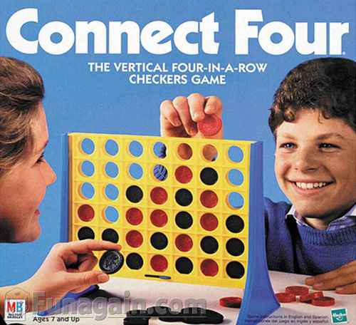

# Project 1 

# Objectives

* Apply software engineering fundamentals to solve a problem using HTML, CSS,
  and JS
* Develop basic project management skills such as whiteboarding, storyboarding,
  and wireframing

# Instructions

Create a web application using HTML, CSS, and JS that creates a playable game
that you choose from the list below.

# Project Rubric

Please see the [rubric](rubric.md)

# Project Games

## Jeopardy

Write a _Jeopardy_ game that allows the user to play the game of _Jeopardy_.
This is a quiz game where the user gets to choose the next question by choosing
from a category and then choosing a point amount (100 to 500). The questions
are phrased as answers and the user chooses from a list of 4 questions that
match the answer. For instance:

The User sees this: `A programming construct for easily looping through the
elements in an array` The User chooses this: `What is a for loop`

### Bonus Ideas:

* Have a "Round 1" and a "Round 2" where the questions in Round 2 are more
  difficult but also score higher points.
* Have different themes for the questions, such as:
  - Web Development Topics
  - Arts and Entertainment
  - Science and Science Fiction

## Hangman

Write a _Hangman_ game that displays a secret word as a list of hidden letters.
Also display an alphabet of letters that the user can guess while trying to
guess the word. After a letter is used, disable that letter from the alphabet
so the user will not try to guess the same letter twice. When a guess matches
one or more letters in the secret word, reveal those letters to the user. Keep
track of the number of incorrect guesses and end the game if the number of
incorrect guesses reaches 6. If the user reveals all of the hidden letters
before reaching 6 incorrect guesses, then the user wins.

### Bonus Ideas:

* Display a _hangman_ as either ASCII art or images that represent the various
  stages of the _hangman_.
* Display a scoreboard of how games won and lost.
* Choose a theme for the game, such as "Famous Movies" or "Web Development
  Terms"

## BlackJack

Write a _BlackJack_ game to try to beat the dealer. Allow the user to "Hit" or
"Stand" based on their current score. Follow the common rules for _BlackJack_.

### Bonus Ideas:
* Allow the user to place a bet (using chips, points, or dollars). Allocate a
  starting amount of chips and keep track of the user's chip count. If the user
  beats the dealer without busting, the user doubles their bet in chips.
  Otherwise the user loses their bet. 
* Allow the user to choose from different decks of cards (e.g. different
  styles)

## Connect 4

Write a _Connect 4_ game that allows two players to compete. The players are
sharing the same computer but the game detects when a player has won the game.
A scoreboard keeps track of how many times Player 1 has won and how many times
Player 2 has won.

### Bonus Ideas:

* Alternate the first player to move: Player 1 moves first in game 1, Player 2
  moves first in game 2, etc.
* Allow players to enter their name and display their name instead of "Player
  1" and "Player 2".
* Provide a way to play against the computer (using a simple A.I. algorithm)

## Simon

Write a _Simon_ game that displays 4 colored buttons (or clickable areas) that
light up and play a sound. Have the computer play a random sequence, starting
with a length of 1 and growing with each round. If the user can replay the
sequence by clicking on the colored buttons in the correct order, then the
computer goes to the next round and the sequence gets longer (same sequence but
with one new randomly generated selection added to the end). If the user is
unable to replay the sequence, then their score is the length of the sequence
they successfully replayed.

Have a unique sound for each colored button and play the sound both when the
computer plays the sequence and when the user clicks on the buttons to replay
the sequence. Have a special sound for when the user makes a mistake.

**You may need to figure out "asynchronous programming" in order to make this
work**

### Bonuses:

* Display a scoreboard of the longest sequence successfully played to date.
* Have a way for the user to choose the difficulty (`easy`, `medium`, or
  `hard`) where the `easy` mode plays the sequence slowly (one second per
  highlighted button) and the `hard` mode plays the sequence more quickly (1/4
  second per highlight).

## Bonuses for Any Game

* Keep score
* Make it responsive
* Add A.I. (player vs. computer)
* Add a timer
* Add music while a player makes a choice
* Create a theme via background images, sounds, music, avatars, etc.
  - Star Wars
  - Favorite Sports Team or Rivalry
  - Comic Book Characters
* Add avatar choices for the player
* Implement multiple games on your site

## Getting Started

* Define your Minimum Viable Product
* Create your wireframes
* Whiteboard high-level app design
* Create your storyboard / issues list
* Deploy your application

## Getting Help

### Process Guidelines for Getting Help

When you need help please follow the following steps:

1. Seek out help online
1. Seek out help with your peers
1. Use the debugging channel on Slack
1. See an instructor personally

Please note __the following are guidelines__ do have exceptions. Your
instructors are approachable, however be sure to follow the appropriate
channels first.

### How to ask for help

*COMMIT/PUSH OFTEN! Your code on GitHub should be up to date. Submitting an
issue and linking your classmates to old, out-of-date code will hinder the
process.*

1. **WHAT YOU ARE TRYING TO SOLVE:**
  - Be able to give a detailed explanation of the feature or user story you're working on.

2. **DETAILED DESCRIPTION OF THE BUG/ERROR:**
  - A detailed description of the problem, the bug, and/or the error. This
    means: the full steps to reproduce, a link to the file on github, and the
    line number of where the relevant code is.  The error(s) returned, copy and
    pasted/typed out/screenshot, not paraphrased.
  - If there is other code in a different file that is also essential to the
    functioning of the code that currently works point us to that and explain
    the relationship.

3. **WHAT I'VE TRIED**
  - List everything you've done to solve the bug on your own in detail. Show
    all resources you've looked up and tried to implement and provide links.

4. **QUESTION**
  - After going through all of these steps, what is your question? ("It's not
    working!" isn't a question.)

## Deploying Your Project
There are a number of hosting sites you can use to deploy your application. We recommend using [Netlify Drop](https://app.netlify.com/drop).

## Sample Project `README.md` files:
* [Tic-Tac-Toe](https://github.com/iamsydsmith/tic-tac-toe)
* [FootUp](https://github.com/wschaeferiii/footup)
* [Wheel of WDI](https://github.com/chadchristensen/wheel_of_wdi/blob/master/README.md)

## Useful Resources

* [MDN Javascript Docs](https://developer.mozilla.org/en-US/docs/Web/JavaScript)
* [jQuery Docs](http://api.jquery.com)
* [GitHub Pages](https://pages.github.com)
