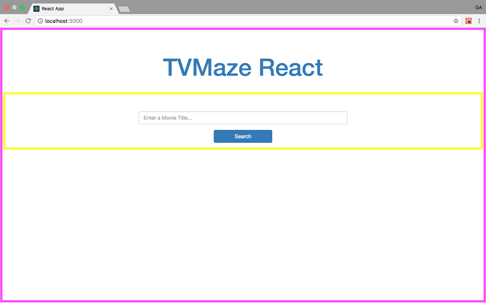
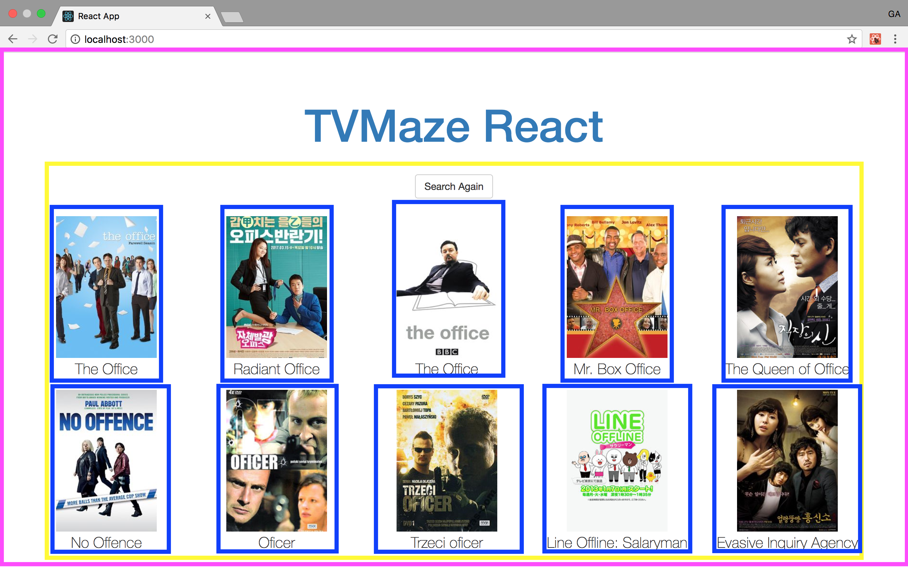

# React TVMaze

## [Start with a Mock](https://facebook.github.io/react/docs/thinking-in-react.html#start-with-a-mock)
First step in creating a React app is to start with a mock and some sample data.
These are the two views for our app:

### The Search Page


I've identified two components on the search page.
1. The top level component, which we'll call `Home`, is boxed in magenta.
2. The search input, a sub-component of `Home`, in yellow we'll call `Search`.

### The Results Page


I've identified three components on this page.
1. The same `Home` top level component.
2. A `results` components which contains results and an option to search again.
3. The individual results

### Component Hierarchy

Given these breakdowns we have a component hierarchy that looks like:
- `Home`
  - `Search`
  - `Results`
    - `Result`

#### Sample Data

Even though we will be using an API to show data dynamically, it can be useful to start with some hard coded data to make sure our UI opperates properly before we connect to an API.  Copy and Paste this array of objects into wherever you declare your highest level of state.

```js
[
  {
    "name":"The Office",
    "image":"http://static.tvmaze.com/uploads/images/medium_portrait/85/213184.jpg"
  },
  {
    "name":"Radiant Office",
    "image":"http://static.tvmaze.com/uploads/images/medium_portrait/101/254702.jpg"
  },
  {
    "name":"The Office",
    "image":"http://static.tvmaze.com/uploads/images/medium_portrait/93/234802.jpg"
  },
  {
    "name":"Mr. Box Office",
    "image":"http://static.tvmaze.com/uploads/images/medium_portrait/97/244942.jpg"
  },
  {
    "name":"The Queen of Office",
    "image":"http://static.tvmaze.com/uploads/images/medium_portrait/58/146476.jpg"
  },
  {
    "name":"No Offence",
    "image":"http://static.tvmaze.com/uploads/images/medium_portrait/48/121682.jpg"
  },
  {
    "name":"Oficer",
    "image":"http://static.tvmaze.com/uploads/images/medium_portrait/29/73047.jpg"
  },
  {
    "name":"Trzeci oficer",
    "image":"http://static.tvmaze.com/uploads/images/medium_portrait/29/73053.jpg"
  },
  {
    "name":"Line Offline: Salaryman",
    "image":"http://static.tvmaze.com/uploads/images/medium_portrait/57/143508.jpg"
  },
  {
    "name":"Utenai Keikan","image":"http://static.tvmaze.com/uploads/images/medium_portrait/42/106093.jpg"
  }
]
```

## [Build a Static Version of the App](https://facebook.github.io/react/docs/thinking-in-react.html#step-2-build-a-static-version-in-react)

First we will build a static version of the app passing all of our data by `props`.
This makes it much easier to avoid getting bogged down in tricky details of functionality while implementing the visual appearance of the UI.

## [Identify the Minimal Representation of UI State](https://facebook.github.io/react/docs/thinking-in-react.html#step-3-identify-the-minimal-but-complete-representation-of-ui-state)

For our app to work we need:
- `movies` (movies to show)
- `query` (title being searched)
- `hasSearched` (boolean determining wether to show the search input or the results)

All of these are subject to change over time and so each must be kept in state.

## [Identify Where Your State Should Live](https://facebook.github.io/react/docs/thinking-in-react.html#step-4-identify-where-your-state-should-live)

Central to considering where state lives is the idea of **one way data flow**.
The react documentation describes this step as "often the most challenging part for newcomers to understand".

Our task here is to look for the component for each aspect of state that could be the one place where that state is managed.

In our app, `query` is needed to keep track of what is going on in the search box, as well as to make the actual query.
This request will return the movies to the same component which managed the query so `movies` should be managed by the same component.
Finally, we have our `hasSearched` flag which we need to set when we make the request so these should all live in the same place.

Currently, the parent to the `Results` and `Search` components is `Home`.
We don't want to clutter our top level component as our app grows so this segues nicely into the idea of Container and Presentational Components.

### [Container & Presentational Components](https://medium.com/@dan_abramov/smart-and-dumb-components-7ca2f9a7c7d0)
The above workflow has led to the currently very popular component architecture of distinguishing container and presentational components.

Presentational components are components that render themselves based solely on the information that they receive from props. At this point, all of our components are presentational.

Container components are components whose job it is to exclusively manage state and as props any data needed by its presentational components.

This leads to a very nice division where state management and presentation are cleanly separated.

We are going to create a `SearchContainer` to manage `query`, `shows`, and `hasSearched`.

## [Add Inverse Data Flow](https://facebook.github.io/react/docs/thinking-in-react.html#step-5-add-inverse-data-flow)
The last step is passing callbacks through props to presentational components to provide behavior.
We will need three functions defined on the `SearchContainer` component to provide necessary behavior to `Search` and `Results`:

1. `handleSearchInput` for managing changes to the input field
2. `onSubmitQuery` for kicking of the ajax request
3. `onSearchAgain` to set state back to render the search bar

## Pre-API Integration Steps

Make sure that your TVMaze application handles user input properly.

### Handling User Input

The user-inputted value will be `SearchContainer`'s `this.state.query`, after you've done the following things...
1. In `SearchContainer`, add the `handleSearchInput` method to the `class`.
2. Pass `handleSearchInput` to the `Search` component via props.
3. In `Search`, you'll have to use the `onChange` event-listener prop to attach the method `handleSearchInput` from `SearchContainer`, available in `Search` as `this.props.handleSubmitInput`. [See here for an example from the React docs](https://reactjs.org/docs/forms.html#controlled-components).

> `handleSearchInput` is being passed down from `SearchContainer`, the parent element, to `Search` the child component. In React's model of unidirectional data-flow, parent components cannot be changed by their children **unless the parent component provides a helper method to its children, passed down via props, that changes the state on the parent**.

## Integrate with the TVMaze API

> Documentation here: https://www.tvmaze.com/api#show-search

There, you'll see an example of a URL you can use to query the TVMaze API. Ultimately, you'll want to replace the example tv program, `girls`, with whatever the user has input into the text box. This should be the value of `SearchContainer`'s `this.state.query`, after you've set everything up properly.

### Adding axios

> Installing axios...

```sh
 $ npm i axios
```

### Fetching Data from the API with axios

> Create a new file called `util.js`. Export a function like so...

**MAKE SURE TO READ THE COMMENTS IN THIS CODE SNIPPET**

```js
import axios from 'axios'

export function queryTVMazeAPI (query) {
  // fill url in with a URL based on the example at: 
  // https://www.tvmaze.com/api#show-search
  // replace a part of the example URL with the user input, which you can 
  // assume will be the parameter of this function, `query`
  const url = '' 
  return axios.get(url) //make sure to return something
       .then(response => console.log(response))
}
```

> Import this function in `SearchContainer` like so...

```js
//somewhere at the top of SearchContainer...
import {queryTVMazeAPI} from './Util'
```

You can now use your queryTVMazeAPI function, which takes one argument, in `SearchContainer`. You will want to pass the user's query as argument to this function when a user has submitted a search.


## Appendix

### More on create-react-app

This project was bootstrapped with [Create React App](https://github.com/facebookincubator/create-react-app).

Below you will find some information on how to perform common tasks.<br>
You can find the most recent version of this guide [here](https://github.com/facebookincubator/create-react-app/blob/master/packages/react-scripts/template/README.md).
