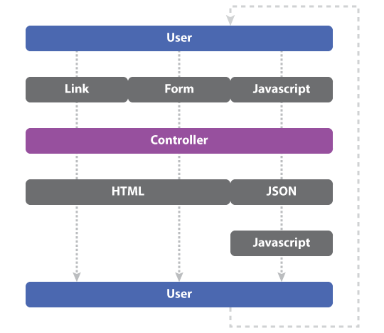
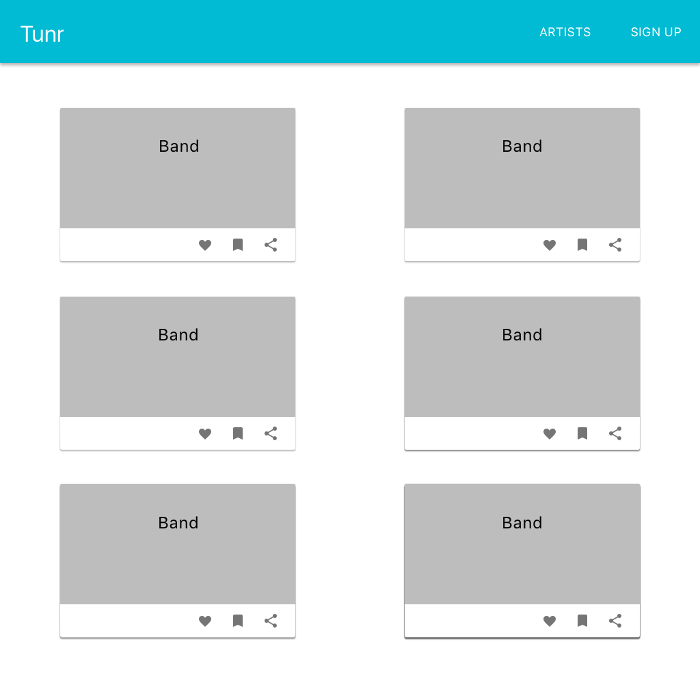
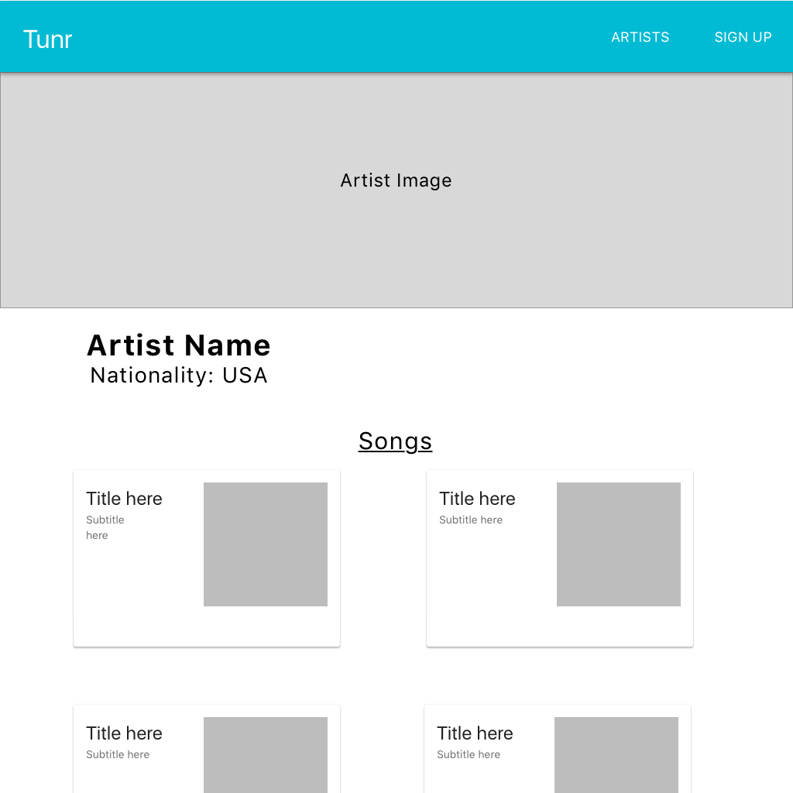

# React W/ Django Rest Framework

## Learning objectives

- Give an example of when and why one might choose to combine a React App with Django.
- Deploy a Django + React application to Heroku.
- Utilize node scripts to build and move a React app to be usable by Django.
- Generate multiple RESTful endpoints using Django Rest Framework.

## Framing

### Django vs React

So far we've seen React apps with a custom built back-end using Express, and Django apps that use the built in templating language or Django Rest Framework. Now we're going to combine the two and make a Django app that utilizes Django Rest Framework AND uses React to handle the UI on the front-end.

Today we are going to be building an application takes advantage of the efficiency of Django Rest Framework with the front-end power that we get from using React.

### Why?

In a typical Django app the user interacts with data through some combination of links, forms, and JavaScript.



> Note, replace Controller with View here.
 
In a Django + React app the user interacts with data just through JavaScript.


This means they have a "single point of contact" with your data. This has two advantages: the user experience may have more consistency (AJAX vs page refreshes), and you have fewer moving parts to worry about.

The trade off here is the need to write more JavaScript. (Which might be a good thing for some of you!)

### Pipenv

Instead of `virtualenv`, today we are going to start using another package management system called `Pipenv`.

Pipenv is a pretty new tool that attempts to make dependency management simpler.  Out of the box, there is no simple dependency list like Node's `package.json` or Ruby's `Gemfile`.  Tools like `virtualenv` combined with text files like `requirements.txt` have tried to bridge the gaps, but the developer experience has never been great.

In Python dependency management has been a very manual process, until Kenneth Reitz of Heroku built the tool `Pipenv`.  This massively simplifies your installation process... and since it was built at Heroku, it makes it easier to deploy.

Let's go ahead and install Pipenv (you will only have to do this once)

```bash
 pip install pipenv
```

#### Create a directory to hold your project

```bash
mkdir music-django-react
cd music-django-react
```

#### Initialize Pipenv in Your Project

Make sure that you are in the root of your Django Project's directory and  run the following command to create your virtual environment:
```bash
pipenv install --three
````

This will create two new files: `Pipfile` and `Pipfile.lock`.  Much like `package.json`. This will keep track of the dependencies within our Django application, without ever neeting to worry about `.venv` files and running `source`.

The only change we make now, is that when we install a project specific library, we will be running `pipenv install LIBRARY_NAME` instead of `pip install LIBRARY_NAME`.

### Getting Started

We are going to build this today (but you will make it look a lot prettier): 
https://django-and-react-solution.herokuapp.com/

The solution code is located in the directory next to this lesson if you get lost!

Lets start out by setting up our environment.

## Setting Up the Django Project

### Install Django Project Dependencies

We can now install the dependencies needed for our project.

```bash
pipenv install django
pipenv install psycopg2-binary
pipenv install django-extensions
pipenv install djangorestframework
```

We'll also add 2 libraries specifically to help us deploy the app to Heroku

```bash
pipenv install gunicorn
pipenv install django-heroku
```

Now we are going to initialize our project as a git repo and add a `.gitignore` file.

Use this [template here](https://github.com/github/gitignore/blob/master/Python.gitignore) for you `.gitingore`
```bash
git init
touch .gitignore
```

Next we will activate our virtual environment:

```bash
pipenv shell
```

and create our Django project and app

```bash
django-admin startproject tunr_project
cd tunr_project
django-admin startapp tunr_app
```

#### You Do: 
Spend a few minutes getting this set up locally and pushed to GitHub.

### Add Apps to INSTALLED_APPS

Navigate to your `settings.py` file, and let's add our downloaded libraries to apps.

```py
# tunr_project/settings.py
INSTALLED_APPS = [
    'django.contrib.admin',
    'django.contrib.auth',
    'django.contrib.contenttypes',
    'django.contrib.sessions',
    'django.contrib.messages',
    'django.contrib.staticfiles',
    'rest_framework',
    'django_extensions',
    'tunr_app'
]
```

### Configure our Local Database

We still need to set up our local database to run on our Macbooks so that we can test in an environment that mirrors our Heroku deployment.

In `psql`:
```sql
CREATE USER sample WITH PASSWORD 'sample';
CREATE DATABASE sample_database WITH OWNER sample;
GRANT ALL PRIVILEGES ON DATABASE sample_database TO sample; --Allows test user to remove and create dbs
```

```python
# tunr_project/settings.py
DATABASES = {
    'default': {
        'ENGINE': 'django.db.backends.postgresql',
        'NAME': 'sample_database',
        'USER': 'sample',
        'PASSWORD': 'sample',
        'HOST': 'localhost'
    }
}
```

## Deploying to Heroku

It's still pretty early, but let's make sure that we can go ahead and deploy to Heroku!  We need to run just a few steps for setup.

### Add Django-Heroku

The library called `django-heroku` is an official Heroku library that allows the platform to easily deploy and run our apps on Heroku.

Installation is really easy.  We just need to add these couple of lines of code to the end of our `settings.py` file.

```py
  # Configure Django App for Heroku.
  import django_heroku
  django_heroku.settings(locals())
```

And that's it! `django_heroku` is going to handle our production database set up, logging, and other behind the scenes stuff that helps us deploy quickly and easily.

### Build a Procfile
`Procfile`s are a common way to tell Heroku how to start your application.  With Python, we will be using a HTTP server called `gunicorn` to run our Django app.  We should have this installed into our Pipenv already, but now let's give Heroku instructions on how to start the app in production.

1. Create a file called `Procfile` at your project root.
2. Add the following text `web: gunicorn YOUR_DJANGO_PROJECT_NAME.wsgi --log-file -`

In this case it would be:
`web: gunicorn tunr_project.wsgi --log-file -`

Now we need to move our `tunr_project`, `tunr_app`, and `manage.py` into the root level of our project and then delete the now empty `tunr_project` folder.

This will make sure `gunicorn` can access our `tunr_project.wsgi`.

Your directory structure should now look like this:
```
├── manage.py
├── Procfile
├── Pipfile
├── Pipfile.lock
├── README.md
├── .gitignore
├── tunr_app
│   ├── __init__.py
│   ├── admin.py
│   ├── apps.py
│   ├── migrations
│   ├── models.py
│   ├── tests.py
│   └── views.py
├── tunr_project
│   ├── __init__.py
│   ├── settings.py
│   ├── urls.py
│   └── wsgi.py
```

## Time to Deploy!
Inside the `music-django-react` directory run...

```bash
  heroku create [project name]
```

This will set up our heroku remote git endpoint. Once that is created, lets set up our production database.

```bash
  heroku addons:create heroku-postgresql:hobby-dev
```

Great! Everything is ready to go to push to production.

```bash
  git push heroku master
```

Once that's complete, let's run our migrations just like we would on our own laptops

```bash
  heroku run python manage.py migrate
```

And viola! Your Django application is officially online! You can run the following command to view it.

```bash
  heroku open
```

### Break (10 min)

## Set Up Create React App

Now that we have our basic Django app built, let's get React set up and deployed as well.

In the root of our project (`music-django-react`), let's build our React app.

```bash
  create-react-app client
```

### Build Script for Heroku

This will build the boilerplate code for our app.  We'll build our front-end here.  But in order to deploy, we need to make sure that Heroku knows that our app needs `npm` and to build the production code for React. In order to do this, lets create a `package.json` file in the root of our `music-django-react` project.

```json
{
  "name": "YOUR PROJECT NAME",
  "scripts": {
    "build": "cd client && npm install && npm run build && cd ..",
    "postinstall": "npm run build && echo 'Client built!'"
  }
}
```

> WARNING!!! Be sure to replace "YOUR PROJECT NAME" above with your real project name.


### Tell Django Where Our Production App Lives

In order for Django to render our React app, we need to tell it where to find the static HTML, CSS, and JS files that make up our app.  In order to do this, there are a couple steps we need to run.

#### Add Path to React App in `settings.py`

In our `settings.py` lets add the location of our react app and the static files for our built application.

```python
import os

# Build paths inside the project like this: os.path.join(BASE_DIR, ...)
BASE_DIR = os.path.dirname(os.path.dirname(os.path.abspath(__file__)))
# Add these two lines.
REACT_APP_DIR = os.path.join(BASE_DIR, 'client')

STATICFILES_DIRS = [
    os.path.join(REACT_APP_DIR, 'build', 'static')
]

...
...
```

### Build a View to Render Static HTML

In order to show our React app, we'll build a view in Django to render our HTML.  Create a file called `views.py` in your `tunr_project` and copy paste the following code.

```python
import logging
import os

from django.views.generic import View
from django.http import HttpResponse
from django.conf import settings

class FrontendAppView(View):
    """
    Serves the compiled frontend entry point (only works if you have run `npm
    run build`).
    """

    def get(self, request):
        try:
            with open(os.path.join(settings.REACT_APP_DIR, 'build', 'index.html')) as f:
                return HttpResponse(f.read())
        except FileNotFoundError:
            logging.exception('Production build of app not found')
            return HttpResponse(
                """
                This URL is only used when you have built the production
                version of the app. Visit http://localhost:3000/ instead, or
                run `npm run build` to test the production version.
                """,
                status=501,
            )
```

### Add Static View to Project URLs

Now that we have this view, we can connect it to our root URL.

```python
...
# tunr_project/urls.py
from django.urls import path, include, re_path
from django.contrib import admin
from . import views

urlpatterns = [
    path('admin/', admin.site.urls),
    path('', views.FrontendAppView.as_view()), #New URL for the index route
    path('api/v1/', include('tunr_app.urls')),
    re_path(r'^.*$', views.FrontendAppView.as_view()), #Says search Frontend for all other routes, so refreshing doesn't make the deployed page error
]

```

Now we need to tell Heroku to build our React app before starting our Django server.

Let's fix that with these 2 commands.

```bash
heroku buildpacks:add --index 1 heroku/nodejs
heroku buildpacks:add --index 2 heroku/python
```

We're now done with the set up of our app! Onward to building some cool stuff!

#### Break (10 min)

## Back End API

### Generate a New App

Now that we are able to deploy our tech stack to Heroku, now it's time to start building out our application!

Create a new `urls.py` file inside your `tunr_app`, and add the following boilerplate

```python
# tunr_app/urls.py
from django.urls import path, include
from . import views

urlpatterns = [
]
```

### Set Up Models
Lets work on creating and seeding our data and serving it as an API for our React UI to consume. For this, we will be using the Django Rest Framework.

Let's start with our Models.  We are going to be starting with 2 simple models that have a one-to-many relationship.

```python
# In tunr_app/models.py
from django.db import models

class Artist(models.Model):
    name = models.CharField(max_length=255)
    photo_url = models.CharField(max_length=400)
    nationality = models.CharField(max_length=255)

    def __str__(self):
        return self.name

class Song(models.Model):
    title = models.CharField(max_length=255)
    album = models.CharField(max_length=255)
    preview_url = models.CharField(max_length=400)
    artist = models.ForeignKey(Artist, on_delete=models.CASCADE, related_name='songs')

    def __str__(self):
        return self.title
```

Once this data is ready to be applied to our database, we'll run 
```bash
./manage.py makemigrations
```
 and 
 ```bash 
 ./manage.py migrate
 ```

### Building The Admin Panel (Or Seeding/Dumping Data)

Next up, we want to get some data to play around with in our app.  We can go about this in a few ways.

#### Set Up Admin Dashboard

In order to use the admin dashboard, we'll need to create a superuser

```bash
python manage.py createsuperuser
```

After this, we add one line to our `tunr_app/admin.py` file. 
```python
# tunr_app/admin.py
from django.contrib import admin
from .models import Artist, Song

admin.site.register([Artist, Song])
```

Now we can go manually add the seed data to our Database.

Alternatively, lets use the `loaddata` and `dumpdata` feature in Django to insert data using a JSON file.

#### You Do: (20 mins)

Read and implement a data dump using Fixtures (info on how to do that [here](https://docs.djangoproject.com/en/2.1/howto/initial-data/)) or use the Admin Dashboard to add some data for Artists and their Songs.  Fixture data is available in the JSON files located in this repo.

### Set Up Django Rest Framework

Since we are using Django Rest Framework to build our backend, it's going to be really easy to get our API routes up and running!

#### Serializers

Create a `serializers.py` file within your `tunr_app`. This is where we will tell DRF what fields to include when presenting data in the API.

```python
# tunr_app/serializers.py
from rest_framework import serializers

from .models import Artist, Song


class SongSerializer(serializers.ModelSerializer):
    class Meta:
        model = Song
        fields = ('id', 'title', 'album', 'preview_url', 'artist')

class ArtistSerializer(serializers.ModelSerializer):
    songs = SongSerializer(many=True, read_only=True)
    class Meta:
        model = Artist
        fields = ('id', 'name', 'photo_url', 'nationality', 'songs')

```

#### Views

After the serializer is made, we will head into `views.py` and use the built in viewset for Django Rest Framework.

```python
# tunr_app/views.py
from rest_framework import viewsets

from .serializers import ArtistSerializer, SongSerializer
from .models import Artist, Song


class ArtistView(viewsets.ModelViewSet):
    queryset = Artist.objects.all()
    serializer_class = ArtistSerializer

class SongView(viewsets.ModelViewSet):
    queryset = Song.objects.all()
    serializer_class = SongSerializer
```

#### URLs

Finally, we'll use the router built into Django Rest Framework to register all of our RESTful routes for each model.

```python
# tunr_app/urls.py
from django.urls import path, include
from rest_framework import routers

from . import views

router = routers.DefaultRouter()
router.register('artists', views.ArtistView)
router.register('songs', views.SongView)


urlpatterns = [
    path('', include(router.urls))
]
```

#### You Do: (10 mins) Test That It Works!

#### You Do: DEPLOY! (Make sure to push to heroku and then migrate your db in Heroku)

```bash
heroku open
```

## Front End: React

Now we have a working API. Let's start building our React UI!

### Connect Front and Back End in our Development Environment

Before we start, we need to make sure our back and front end can communicate when we are working locally.  In order to do this, we will add
a `proxy` entry in our React apps `package.json`

```json
{
  "name": "client",
  "version": "0.1.0",
  "private": true,
  "proxy": "http://localhost:8000",
  ...
}
```

### You Do
Look at these 2 wireframes for the Tunr UI and determine what types of React components we will need for this app.




### React Router Set Up

We set up our React app during an earlier step, but we still have a couple steps to go in order to set up the to.

Let's go into our **client** directory and install a few libraries to use in our React project.

```bash
  npm i styled-components axios react-router-dom
```

Next we need to add React Router to our project and make a few client-side routes to control the flow of our app.

```jsx
// App.js
import React, {Component} from "react";
import {BrowserRouter as Router, Route, Switch, Link} from "react-router-dom";
import ArtistList from "./components/ArtistList";
import Artist from "./components/Artist";
import "./App.css";

class App extends Component {
    render() {
        return (
            <Router>
                <div className="App">

                    <div>
                        <h1>Tunr</h1>
                        <div>
                            <div><Link to="/">All Artists</Link></div>
                        </div>
                    </div>

                    <Switch>
                      <Route exact path="/" component={ArtistList}/>
                      <Route path="/artist/:id" component={Artist}/>
                    </Switch>
                </div>
            </Router>
        );
    }
}

export default App;
```

This requires us to create several components. First, create a `components` directory within `client/src/`. Let's make basic components for ArtistList, Artist.

After creating those components, we should be able to test the links and validate that they are both valid.

**COMMIT**

### React Artists List

Let's first focus on building a list of Artists that link to their own individual Artist pages.

```jsx
import React, { Component } from 'react';
import { Link } from 'react-router-dom';
import axios from 'axios';

class ArtistList extends Component {
    state = {
        error: '',
        artists: []
    }

    componentDidMount(){
        this.fetchArtists();
    }

    fetchArtists = async () => {
        try {
            const res = await axios.get('/api/v1/artists');
            this.setState({artists: res.data});
        }
        catch (err) {
            console.log(err)
            this.setState({error: err.message})
        }
    }

    render() {
        if (this.state.error){
            return <div>{this.state.error}</div>
        }
        return (
            <div>
                <h1>All Artists</h1>
                {this.state.artists.map(artist => (
                    <div key={artist.id}>
                        <Link to={`/artist/${artist.id}`} >{artist.name}</Link>
                    </div>
                ))}
            </div>
        );
    }
}

export default ArtistList;
```

#### async/await

You probably noticed above that we didn't use a `.then` & `.catch` block in the above code.  Instead we used some keywords you many not be familiar with, `async` and `await`.  This is a new feature of ES7, can be used with `create-react-app`, and was introduced in Node 8.  Basically, this new syntax makes asynchronous code look a little cleaner.  It achieves the same purpose as traditional promises.

```jsx
  fetchArtists = () => {
    axios.get('/api/v1/artists').then(res => {
      return this.setState({artists: res.data});
    }).catch(err => {
      console.log(err)
      this.setState({error: err.message})
    })
  }
```

vs

```jsx
  fetchArtists = async () => {
      try {
          const res = await axios.get('/api/v1/artists');
          this.setState({artists: res.data});
          return res.data;
      }
      catch (err) {
          console.log(err)
          this.setState({error: err.message})
          return err.message
      }
    }
```

For more info about async/await check out these links:

* [Async/Await in 10 minutes](https://tutorialzine.com/2017/07/javascript-async-await-explained)
* [Async/Await - FunFunFunction ](https://www.youtube.com/watch?v=568g8hxJJp4)

### Show Individual Artist

Let's also go ahead and create a view that allows us to see info about a specific Artist

```jsx
import React, {Component} from 'react';
import axios from 'axios';

class Artist extends Component {

    state = {
            artist: {},
            songs: [],
    }

    componentDidMount() {
        const artistId = this.props.match.params.id;
        this.fetchArtist(artistId)
    }

    fetchArtist = async (artistId) => {
        try {
            const artistResponse = await axios.get(`/api/v1/artists/${artistId}`)
            this.setState({
                artist: artistResponse.data,
                songs: artistResponse.data.songs,
            })
        }
        catch (error) {
            console.log(error)
            this.setState({error: error.message})
        }
    }

    render() {
        return (
            <div>
                
                <h1>{this.state.artist.name}</h1>
                {this.state.songs.map(song => (
                    <div key={song.id}>
                        <h4>{song.title}</h4>
                        <audio controls src={song.preview_url}></audio>
                    </div>
                ))}
            </div>
        );
    }
}

export default Artist;

```

With this component, we now have the ability to traverse between an all artists and individual artist view.  

**COMMIT**

### Styling With Styled Components

**YOU DO** Spend ~30 minutes adding some styling polish to the app to make it look more similar to the wire frames above. 

**COMMIT**
**DEPLOY**