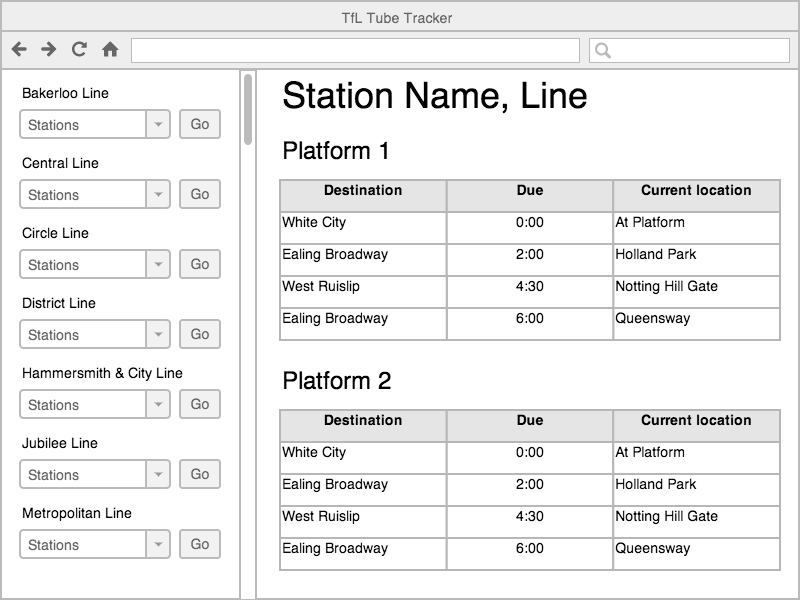

# Thinking In React

React requires us to think about our web applications in a very specific way. No longer will we have a dense, monolithic front-end application. Instead we should think of a page as the sum of as many small, distinct components as we can build. This way of thinking has been branded by the React team as **"Thinking In React"**.

### Take 10 minutes and read this article from the excellent React docs: [Thinking in React](https://facebook.github.io/react/docs/thinking-in-react.html)

# Intro to React.js


## Learning Objectives

* Explain what a frontend framework is and why they can be helpful in writing more complex applications.
* Explain what ReactJS is and where it fits in our applications' stack.
* Explain the component model of web development.
* Create and render React components in the browser.

## Framing

### What is a Frontend Framework? (5 min)

- A framework is software providing generic functionality and structure that serves as foundation to build and deploy applications.
- Express is a framework that runs on the server, receiving incoming request from the client, preforming some work that you have defined, and returning some response to the client.  Front-end frameworks run in the client's browser, receive input from interactions with the page, perform some work that you have defined, and make any updates necessary.
- Frameworks can help standardize code, give you additional functionality and performance, and can help get your code off the ground faster.  
- There are [many](https://stateofjs.com/2017/front-end/) front end frameworks and each go about solving problems of how state is managed, updated, and represented by a view but there are many commonalities.
- There is a lot of debate over whether frontend frameworks count as frameworks at all -- some people say that they are just libraries and should be referred to as such.

### What is ReactJS? (5 min)

React is a client-side library created by Facebook and is currently the most popular front-end library available. React builds on the progress made by previous front-end frameworks, such as EmberJS and AngularJS, but has its own set of goals and priorities.

While many other frameworks focus on the flow of data within a front-end application, React is narrower in focus.  Instead, React focuses solely on building dynamic UIs that are updated efficiently.  We will do this using JavaScript, an extension called JSX, and a build tool called Webpack.  This means no more Handlebars to handle our views!


#### React Dev Tools

Please install the following Chrome extension: [React Dev Tools](https://chrome.google.com/webstore/detail/react-developer-tools/fmkadmapgofadopljbjfkapdkoienihi?hl=en).

#### Some History

The first thing most people hear about React is "Facebook uses it."
* First used by Facebook in 2011.
* Then Instagram in 2012.
* Went open source in May 2013.
* Changed licence to MIT in 2017.

React was born out of Facebook's frustration with the traditional MVC model and how..
  * Re-rendering something meant re-rendering everything (or just a lot).
  * That had negative implications on processing power and ultimately user experience, which at times became glitchy and laggy.

> If you want to get a taste of what React is all about, [here's an introduction from React.js Conf 2015](https://www.youtube.com/watch?v=KVZ-P-ZI6W4&feature=youtu.be&t=510). Recommend starting around the 8:35 mark and watching until 16:30.

### React in MVC

React can be thought of as the "Views" layer.

React will work with any back-end language, but for project 3 and in our in-class examples we will be using Mongoose and Express for the models and controllers.

<details>
  <summary><strong>What is the role of a "view" in a front-end Javascript application?</strong></summary>
  The visual template the user sees, often populated with data from our models.
</details>

## Components (10 min)

One comment made about React when it was first open sourced was "Rethinking established best practices" which kind of became the React motto.  In React, we want to move away from template pages, away from separating code based purely on file type, and more towards a **component-based** separation of concerns.  [Templates vs Components](https://wanderoak.co/fixed-templates-vs-components/)


> [WanderOak - Fixed Templates vs. Components](https://wanderoak.co/fixed-templates-vs-components/)

When taking a look at Facebook, you could think of each status post as a mini-component in React. And a list of those updates, is a component that contains several of those mini-components. You could take that one step further and think of the Facebook app, as one giant component with several components within it. (Things like the list of status updates, the friends list, the header, etc...)

Imagine you worked at Facebook when they wanted to shift from using likes to reactions. Using traditional JavaScript, HTML, and CSS the shift would make you have to change your code in a bunch of places. Component based architecture allows us to maintain our code more easily.



> [MakeTea - Building Robust Apps with React](http://maketea.co.uk/2014/03/05/building-robust-web-apps-with-react-part-1.html)

Notice the structure of how the various components are nested. 
```
- TubeTracker
    - Network
        - Line
    - Predictions
        - DepartureBoard
            - Trains
```

TubeTracker contains the application
Network displays each line on the network
Line displays the stations on a line
Predictions controls the state of the departure board
DepartureBoard displays the current station and platforms
Trains displays the trains due to arrive at a platform

### [F.I.R.S.T. Components](https://addyosmani.com/first/)

A React component is built to expect an input and render a UI with it. More importantly, a well-structured component only receives data specific to its purpose.

This is because React follows a more **functional** approach to programming. For React components under this approach, **the same input will always produce the same output**.

Best practice is that React components follow the **F.I.R.S.T.** guidelines

#### Focused

Components should do one thing and do it well.

#### Independent

Components should increase cohesion and reduce coupling. Behavior in one component should not impact the behavior of another. In other words, components should not rely on one another.

> But they should compliment one another.

#### Reusable

Components should be written in a way that reduces the duplication of code.

#### Small

Ideally, components should be short and condensed.

#### Testable

Because the same input will always produce the same output, components are easily unit testable.

> If you're interested, [Jest](https://facebook.github.io/jest/docs/tutorial-react.html) is a popular testing library for React.


## Exercise: Identifying Components (15 min)

> 10 minutes exercise. 5 minutes review.
* Break into groups of three and take a look at Facebook, Craigslist, Ebay, or a website of your choice. Identify the visual "components" the website is comprised of. Use markers to draw these out on the wall.

As you're drawing this out, think about the following questions...
* Where do you see "nested components"? Where do you not?
* Are there any components that share the same structure?
* Of these similar components, what is different about them?

## Initial Setup (20 min)

In order to create a new project and to get our development environment setup, we are going to use the terminal command `create-react-app`. It will create a new folder in your current directory for the in-class application.

`create-react-app` is an NPM package also built by Facebook that writes our build dependencies for us so that we can do less configuration. It allows us to use React, JSX, and ES6. It also allows us to import our CSS, it autoprefixes our CSS so that we don't have to worry about cross browser compatibility, it gives us a dev server to run, and it enables hot reloading which updates the code in our browser without us refreshing the page.

It uses Webpack which is a build tool that enables many of the features listed above. It also includes Babel which transpiles our JavaScript from ES6 to be compatible with older browsers. It also includes Autoprefixer for CSS compatibility, ESLint for linting, and Jest for testing.

You can also set up all this yourself, but for now `create-react-app` allows us to worry more about our code and less about configuration.

```bash
$ npm i -g create-react-app
$ create-react-app blog-app
$ cd blog-app
$ code .
$ npm run start
```

> Here you will begin setting up a blog app that you will continue working on during this lesson's exercises. For demonstration purposes, We will be creating a simple "hello world" app.

After running `$ npm run start`, we can view the app at `http://localhost:3000`

`create-react-app` provides us with all the necessary tools and configuration necessary to start writing React. `npm run start` refers to an included script that starts up the development server.

Along with installing the necessary dependencies, it creates an initial app skeleton that looks like this...

```bash
├──README.md
├──  favicon.ico
├──  index.html
├──  node_modules
├──  package.json
└──  src
    ├──  App.css
    ├──  App.js
    ├──  index.css
    ├──  index.js
    └──  logo.svg
```

Most of the important files, which are primarily the ones where we will be working today, are in the `/src` directory.

Take some time and look at what's been generated. Specifically look in `App.js` and `index.js`


## Break: (10 min)
---

### We Do: Hello World - A Very Basic Component (10 min)

The basic unit you'll be working with in ReactJS is a **component**.

* Components can be thought of as functional elements that take in data and as a result, produce a dynamic UI.

Throughout class we have separated HTML, CSS and Javascript.
* With components, the lines between those three become a bit blurry.
* Instead, we organize our web apps according to small, reusable components that define their own content, presentation and behavior.  

What does a component look like? Let's start with a simple "Hello World" example...

To start, in our `/src/App.js` file, let's remove the contents and in its place add this component definition...

```js
// Bring in React and Component instance from React
import React, {Component} from 'react'

// define our Hello component
class Hello extends Component {
  // what should the component render
  render () {
    // Make sure to return some UI
    return (
      <h1>Hello World!</h1>
    )
  }
}

export default Hello
```

Let's break down the things we see here...

##### `import React, { Component } from 'react`
The first thing we see are some import statements. When we look a little deeper though, we begin to see some interesting new ES6 syntax on. See those curly braces around Component? This a fantastic feature of ES6 called "destructuring

As you can imagine, there are going to be certain segments of the React code that we use all the time. While we could use dot-notation to pull each of these objects off of the parent React object each time, that might become a little redundant. "Destructuring" allows us to save some typing by importing values off of an object directly and creating a new variable just for that small part. In other words, while we could do this:

```
 import React from 'react';
 
 class MyNewComponent extends React.Component { 
 	...
 }
```

We can accomplish the same thing, and avoid having to use lengthy and hard to read dot-notation, with this code:

```
 import React, { Component } from 'react';
 
 class MyNewComponent extends Component { 
 	...
 }
 ```


##### `class Hello`
This is the component we're creating. In this example, we are creating a "Hello" component. 

Components are just classes! If React is all about building components, and components are just plain old Javascript classes, then that means React is just plain old Javascript. While all Javascript frameworks inherently use the Javascript language, many of them solve problems in very proprietary ways. This isn't so with React. If we know how to write modern Javascript, most of the learning curve for React is already out of the way.

##### `extends Component`
This is the React library class we inherit from to create our component definition.

##### `render()`
Every component has, at minimum, a render method. It generates a **Virtual DOM** node that will be added to the actual DOM.
* Looks just like a regular ol' DOM node, but it's not yet attached to the DOM.

##### `export default Hello`
This exposes the Hello class to other files which import from the App.js file. The `default` keyword means that any import that's name doesn't match a named export will automatically revert to this. Only one default is allowed per file.

Until now, we have been using the Node-friendly `module.exports = ThingToExport;` syntax. With the brand new JS syntax that Webpack enables for us, we can switch to the more friendly export default ThingToExport;.

### JSX (5 min)

> Hey you got your html in my javascript!
>
> You got your javascript in my html!
>
> (https://youtu.be/O7oD_oX-Gio?t=5s)

Let's talk about the value that the render method returns. It looks an awful lot like an HTML heading, but it's not. We often write out React components in JSX.  We will be taking a deeper dive into JSX.

JSX is [a language that compiles to Javascipt](http://blog.yld.io/2015/06/10/getting-started-with-react-and-node-js/#.V8eDk5MrJPN) that allows us to write code that strongly resembles HTML. It is eventually compiled to lightweight JavaScript objects.

Your Hello component's render method:

* Currently returns JSX, not HTML.
The JSX creates a heading with 'Hello World!'.
* Your component reads this and renders a "Hello World!" heading.

> React can be written without JSX. If you want to learn more, [check out this blog post](http://jamesknelson.com/learn-raw-react-no-jsx-flux-es6-webpack/).  


## Virtual DOM (5 min)

You may have noticed that our `src/index.js` code mentions ReactDOM. ReactDOM doesn't refer to the same DOM we know. Instead, it refers to a Virtual DOM. The Virtual DOM is a key piece of how React works.

The Virtual DOM is a Javascript representation of the actual DOM. The virtual DOM is a staging area for changes that will eventually be implemented.

* Because of that, React can keep track of changes in the actual DOM by comparing different instances of the Virtual DOM.
* React then isolates the changes between old and new instances of the Virtual DOM and then only updates the actual DOM with the necessary changes.
* By only making the "necessary changes," as opposed to re-rendering an entire view altogether, we save up on processing power.
* This is not unlike Git, with which you compare the difference -- or `diff` -- between two commits.


> If you're interested in learning more about the Virtual DOM, [check this video out](https://www.youtube.com/watch?v=-DX3vJiqxm4).


Most of the time you won't have to touch this file. 

So we've created the template for our component. Now, let's use `/src/index.js` to load in our new component and render it on the DOM...

```js
import React from 'react'
import ReactDOM from 'react-dom'
import Hello from './App.js'

ReactDOM.render(
  <Hello />,
  document.getElementById('root')
)
```
> In place of `ReactDOM.render` some tutorials will use React.renderComponent, which has been phased out. The change is outlined [here](http://bit.ly/1E81Whs).

`ReactDOM.render` takes the Virtual DOM node created by `extends Component` and adds it to the actual DOM. It takes two arguments...

  1. The component.
  2. The DOM element we want to append it to.

> **NOTE:** Whenever you use a self-closing tag in JSX, you **MUST** end it with a `/` like `<Hello />` in the above example.

> **NOTE:** The fact that ReactDOM is a separate library is actually a brilliant design decision.  This has opened up React to being able to compile code to GUIs other than the DOM.  React Native and React VR are two good examples of alternate renderers that can use code VERY similar to what we are writing for the DOM

---

### Hello World: A Little Dynamic (15 min)

Our `Hello` component isn't too helpful. Let's make it more interesting.
* Rather than simply display "Hello world", let's display a greeting to the user.
* So the question is, how do we feed a name to our `Hello` component without hardcoding it into our render method?

First, we pass in data wherever we are rendering our component, in this case in `src/index.js`...

```js
import React from 'react'
import ReactDOM from 'react-dom'
import Hello from './App.js'

ReactDOM.render(
  <Hello name={"Nick"} />,
  document.getElementById('root')
)
```

Then in our component definition, we have a reference to that data via as a property on the `props` object...

```js
class Hello extends Component {
  render () {
    return (
      <h1>Hello {this.props.name}</h1>
    )
  }
}
```

In the above example, we replaced "world" with `{this.props.name}`.

#### What are `.props`?

Properties! Every component has `.props`
* Properties are immutable. That is, they cannot be changed while your program is running.
* We define properties in development and pass them in as attributes to the JSX element in our `.render` method.

First we can pass multiple properties to our component when its rendered in `src/index.js`..

```js
import React from 'react';
import ReactDOM from 'react-dom'
import Hello from './App.js'

ReactDOM.render(
  <Hello name={"Nick"} age={24} />,
  document.getElementById('root')
)
```

Then in our component definition we have access to both values...

```js
class Hello extends Component {
  render () {
    return (
      <div>
        <h1>Hello {this.props.name}</h1>
        <p>You are {this.props.age} years old</p>
      </div>
    )
  }
}

```

> **NOTE:** The return statement in `render` can only return one DOM element. You can, however, place multiple elements within a parent DOM element, like we do in the previous example with `<div>`.

## Break (10 min)

---

## You Do: A Blog Post (25 min)
> 20 min to work, 5 min review

Let's have some practice creating a React component from scratch. How about a blog post?
* Create a `post` object literal in `src/index.js` above `ReactDOM.render()` that has the below properties.
  1. `title`
  2. `author`
  3. `body`
  4. `comments` (array of strings)
* Render these properties using a Post component.
* The composition of your Post is up to you.

If you finish early, try experimenting with CSS (Make Sure you use `className` instead of `class` in `JSX`!)

#### [Solution](https://github.com/ga-wdi-exercises/simple-react-blog/commit/f1088165898d1a20df956647c8e9b5ed67d9ad32)

---

## Nested Components (10 minutes)

#### Q: What problems did you encounter when trying to add multiple comments to your Post?

It would be a pain to have to explicitly define every comment inside of `<Post />`, especially if each comment itself had multiple properties.
* This problem is a tell tale sign that our separation of concerns is being stretched, and it's time to break things into a new component.

We can nest a Comment component within a Post component.
* We create these comments the same way we did with posts: `extends Component` and `render`
* Then we can reference a comment using `<Comment />` inside of Post's render method.

Let's create a new file for our Comment component, `src/Comment.js`...

```js
import React, {Component} from 'react'

class Comment extends Component {
  render () {
    return (
      <div>
        <p>{this.props.message}</p>
      </div>
    )
  }
}

export default Comment
```

Then in `src/App.js`, we need to load in our `Comment` component and render it inside of our `Post` component...

```js
import React, { Component } from 'react';
// Load in Comment component
import Comment from './Comment.js'


class Post extends Component {
  render() {
    return (
      <div>
        <h1>{this.props.title}</h1>
        <p>By {this.props.author}</p>
        <div>
          <p>{this.props.body}</p>
        </div>
        <h3>Comments:</h3>
        // Render Comment component, passing in data
        <Comment message={this.props.comments[0]} />
      </div>
    );
  }
}

export default Post;
```

> **Note**: We could put all of our code in one file, but it's considered a good practice to break components out into different files to help practice separation of concerns. The only downside is we have to be extra conscious of remembering to **export / import** each component to where it's rendered.

The above code works, but we'd have to hard-code all of our `Comments`.  This is not very dry and our code will not dynamically change.  The best way to handle this is to set a variable equal to all of the `<Comments />` for this post.  We can do this using `.map` in `Post's` `render` method.

We can use `.map` in `Post's` `render` method to avoid having to hard-code all of our `Comments`

```js
class Post extends Component {
  render() {
    let comments = this.props.comments.map((comment, index) => (
      <Comment message={comment} key={index}/>
    ))
    return(
      <div className='post-page'>
        <h1>{this.props.title}</h1>
        <h2>By {this.props.author}</h2>
        <p>{this.props.body}</p>

        <h3>Comments</h3>
        {comments}
      </div>
    )
  }
}

```

## Break

# JSX Overviews and Gotchas

### Objectives

- Understand what JSX is and why it is different than HTML.
- Identify differences in syntax between HTML and JSX.
- Loop through arrays of data and apply it to JSX rendering.
- Describe what `props` relates to in React
- Insert data from `props` to JSX

### Preparation

- Create a React application using `create-react-app`.
- Write HTML and be familiar DOM manipulation in JavaScript

<br>

If you've ever written HTML strings within JavaScript, you know that the experience can be a huge pain.  Developers are required to write and concatenate strings that get converted to HTML after being appended to the DOM. Many times this looks really messy (i.e. `"<h1>" + firstName + " " + lastName + "</h1> `) even with ES6 string templates!  For this reason, we use a tool called JSX to easily and cleanly write expressive statements that sends HTML to the DOM.

## JSX (10 minutes, 0:10)

JSX was chosen by Facebook to provide a descriptive and clean way to structure the HTML that React sends to the DOM. Before JSX, developers would render HTML through the `React.createElement()` method.

```js
const HelloWorld = React.createElement({
  "h1", // Container Element
  null, // Attributes within the container element
  "Hello World" // HTML String
});
```
---
```js
const User = React.createElement(
    "div",
    null,
    React.createElement(
      "p",
      null,
      "Bob"
    ),
    React.createElement(Button, null, "add friend")
  );
}
```

While this rendered HTML extremely efficiently, it can be difficult to parse and understand.  Because of this, JSX was created to provide developers a more expressive and familiar way to write elements to be rendered to the DOM.  JSX is written out as a mark-up language, just like HTML.

```js
const Element =; <h1>Hello; World</h1>;
```
---
```js
const User = (
  <div>
    <p>Bob</p>
    <button>add; friend</button>
  </div>;
)
```
I know the question you are all asking... "How is this valid JavaScript? This would cause errors in other JavaScript apps!"  And you're right!  JSX is actually a language extension to JavaScript that will convert this 'HTML in JS' into pure JavaScript.  When Webpack & create-react-app is bundling your React code, it converts the JSX syntax into the `React.createElement()` method seen above.

### CodeAlong: React Portfolio Page (15 minutes, 0:25)
Let's jump in head first and learn JSX by doing.  Today we will build a simple portfolio page using just React and JSX.

#### Getting Started
Navigate to your in-class directory and run `create-react-app react-portfolio`

```bash
create-react-app react-portfolio
cd react-portfolio
code .
npm start
```

We now have a basic page that allows us to get started building our portfolio.  Let's first take a deep dive into the starter code that `create-react-app` gave us. Specifically, let's look at the `App.js` file.

```js
import React, { Component } from 'react';
import logo from './logo.svg';
import './App.css';

class App extends Component {
  render() {
    return (
      <div; className="App">
        <div; className="App-header">
          
          <h2>Welcome; to; React</h2>
        </div>
        <p; className="App-intro">
          To; get; started, edit <code>src/App.js</code> and save to reload.
        </p>
      </div>;
    )
  }
}

export default App;
```

**render(){}**: Every time you create a React Component class, you will use the `render` function. Render is one of several **lifecycle methods** built into React.  We'll go in-depth on what that means later in class. This function tells React what the output of your component will be upon it's initial creation and every time it updates.  We will **always** return JSX code in this function.

**return ()**: Since render is just a regular method call, we have to `return` something.  Here we write the JSX that we want our component to output.  When we have more than 1 line, we wrap the entire JSX statement in `()`.

**className**: One of the most noticeable differences between HTML and JSX is the use of `className` rather than `class`. Since we write JSX within JavaScript files, we cannot use keywords within the JavaScript language.  This means we shouldn't use names like `class` and `for` when using JSX.  Instead, JSX provides `className` and `htmlFor` as replacements.  Most other HTML attributes will be exactly the same in JSX.  You can see all of the available attributes here: [Tags and Attributes](https://zhenyong.github.io/react/docs/tags-and-attributes.html)

**src={logo}**: Another major feature of JSX is the ability to switch between JSX and JavaScript on the fly.  By wrapping an expression in `{}`, we are able to refer to variables and objects.  In the code above, you use `src={logo}` to import the SVG file that was defined earlier in the component.  When our app gets bundled through Webpack, the path of the SVG is inserted into the HTML that gets rendered into the DOM.  We can also use `{}` to use functions like `.map`, `.filter`, and `.reduce` to manipulate our data.

### Import/Export
We already know that you can import and export JavaScript methods through the new ES6 module system. You can also import static objects like photos and CSS very easily.

```js
import logo from './logo.svg';
import './App.css';
```
vs
```js
const logo = require('./logo.svg');
require('./App.css');
```

In this example, we can see that we can import static files two different ways.

- Import it as a named variable that can be later referenced in JSX.
- Import the file without a name, which just signals to Webpack to load the content and make it available at runtime.

In addition to making this a clean and easy way to refer to your static assets, this also allows Webpack to convert your images into a data URI.  This allows your page to load quicker and make less requests to the server.

> Take note that this is specific for CLIENT side JavaScript.  You cannot use this syntax in Node just yet.

#### We Do: Profile Page (15 minutes, 0:40)
Now that we've seen an example of some valid JSX, let's create a few components to build out our Portfolio. The first thing we should do is focus on keeping our file directory clean.  Before we create any new files, lets create a `components` directory inside of `src`.  This will hold all of the components we will be building during the codealong.  Within the components directory, let's create a file called `Profile.js`.  Your directory should look something like this.

```
|...
|- public/
|- src/
  |- components/
    |- Profile.js
  |- App.css
  |- App.js
  |...
|- .gitignore
|...
```

Within your `Profile.js` file, let's create a basic React Component

```js
import React, { Component } from 'react';

class Profile extends Component {
  render(){
    return (
      <h1>Hello; World;!</h1>;
    )
  }
}

export default Profile;
```

**GOTCHA** Why do we have to import `React` here?  Since we don't reference it in the rest of the file, we should be fine skipping it, right?  Let's see what happens if we remove `React` as an import.

```
ERROR: 'React' must be in scope when using JSX  react/react-in-jsx-scope
```

We get this error because even though we don't reference the React variable, it is being used by Webpack whenever it converts our JSX code to `React.createElement`;

Now that we have a component, let's import it into our App.js.

```js
import React, { Component } from 'react';
import './App.css';
import profile from './components/Profile.js'

class App extends Component {
  render() {
    return (
      <div; className="App">
        <profile />
      </div>;
    )
  }
}

export default App;
```

**GOTCHA**: We always capitalize React components.  If we use lower case, JSX will interpret it as a regular HTML tag.

**GOTCHA AGAIN**: Notice the closing tag on the React component (`/>`).  Another big difference between HTML and JSX is that JSX is very picky about opening and closing tags.  Every tag you make in JSX has to be closed (i.e `<h1></h1>` or `<span />`)

Once we properly import our `Profile` component, we should see a big "Hello World!" on the page.

#### Adding onto the Profile component (5 minutes, 0:45)

Let's beef up our Profile component with a picture and our name.

```js
import React, { Component } from 'react';

class Profile extends Component {
  render(){
    return (
      
      <h1>Nic; Cage</h1>
      <h3>Full; Stack; Developer</h3>;
    )
  }
}

export default Profile;
```

**OH NO**: Something broke! `Syntax error: Adjacent JSX elements must be wrapped in an enclosing tag (7:6)`

**GOTCHA**: When rendering JSX, there can only be one top-level element. Having multiple elements without a container element will always throw an error.  We generally fix that by wrapping the JSX with a `<div></div>` tag.

After wrapping the tags in a div, we should see the first bit of our profile page. Hooray!

#### Building out a Specializations component (15 minutes, 1:00)
Now that we have built out all the info we need for a splash page, let's add some more content to the page.  Next up, we want to build a section of the portfolio page that will show of what technologies we know.  Let's look at the wire-frame of what we want to build.


**WE DO** 
* Create a component called `Specialties.js` and insert it into `App.js`.

* Use JSX to add a `h2` tag that says "I specialize in..."

* Follow along with the wire-frame to create 3 specialization cards.

* Specialty data:
```
Specialty 1
  JavaScript
  Image Url: https://upload.wikimedia.org/wikipedia/commons/thumb/9/99/Unofficial_JavaScript_logo_2.svg/2000px-Unofficial_JavaScript_logo_2.svg.png
  Description: JavaScript is a programming language commonly used in web development. It was originally developed by Netscape as a means to add dynamic and interactive elements to websites. While JavaScript is influenced by Java, the syntax is more similar to C and is based on ECMAScript, a scripting language developed by Sun Microsystems.

Specialty 2
  Ruby
  Image Url: https://blog.joefallon.net/wp-content/uploads/2014/07/rubylang.png
  Description: Ruby is a dynamic, reflective, object-oriented, general-purpose programming language. It was designed and developed in the mid-1990s by Yukihiro "Matz" Matsumoto in Japan. According to its creator, Ruby was influenced by Perl, Smalltalk, Eiffel, Ada, and Lisp.[11] It supports multiple programming paradigms, including functional, object-oriented, and imperative. It also has a dynamic type system and automatic memory management.

Specialty 3
  Node.js
  Image Url: https://upload.wikimedia.org/wikipedia/commons/thumb/d/d9/Node.js_logo.svg/1200px-Node.js_logo.svg.png
  Description: Node.js is an open-source, cross-platform JavaScript run-time environment for executing JavaScript code server-side. Historically, JavaScript was used primarily for client-side scripting, in which scripts written in JavaScript are embedded in a webpage's HTML, to be run client-side by a JavaScript engine in the user's web browser. Node.js enables JavaScript to be used for server-side scripting, and runs scripts server-side to produce dynamic web page content before the page is sent to the user's web browser. 
```

#### DRYing up your code with loops and props (15 minutes, 1:15)
You may have noticed that we've repeated a lot of JSX within the Specialties component.  This is a bad practice.  The React philosophy is to make your components very small and ideally reusable.  We have 3 component's here that all look pretty similar, so lets extract them into their own smaller component.

Let's create a `Specialization` component that will contain a single specialization.  We will then pass data into this generic component by taking advantage of React's unidirectional data flow.

### Unidirectional Data Flow

Data flow in React works in one direction to make the logic of your application simpler.  Because of this philosophy, we can only pass data from Parent element to Child element.  We are able to pass this data in JSX by adding attributes to the child elements. This data then is sent to a special object called `this.props`.

### this.props (5 minutes, 1:20)

`this.props` is how we are able to retrieve data that is passed down from Parent to Child element.  `this.props` allows us to write out reusable and dynamic JSX code. We can create multiple of the same element, and have it render different HTML in the DOM based on what elements we pass through the parent component.

Let's look at this example of a Parent/Child relationship.

```js
class Taco extends Component{
  render(){
    return; <h1>I; love; {this.props.flavor} tacos;!</h1>
  }
}
class Tacos extends Component{
  render(){
    const flavors = ['Guacamole', 'Beef', 'Bean'];
    return (
      <div>
        <Taco; flavor={flavors[0]}>
        <Taco; flavor={flavors[1]}>
        <Taco; flavor={flavors[2]}>
      </div>;
    )
  }
}
```

Will output

```html
  <div>
    <h1>I love Guacamole tacos!</h1>
    <h1>I love Beef tacos!</h1>
    <h1>I love Bean tacos!</h1>
  </div>
```

**AGAIN** Props can only be passed down from parent to child element.  You cannot pass props from child to parent component

#### Looping in JSX (5 minutes, 1:25)
This example can still be cleaned up even further. In the `Tacos` example component, we call `Taco` three times.  What if we had 100 favorite tacos? That would be a huge pain to type out by hand.  Thankfully, we can use JavaScript to loop in JSX.  In order to do this, we use the array methods available to us in JavaScript. (i.e. Map, Filter, etc.)  

```js
class Tacos extends Component{
  render(){
    const flavors = ['Guacamole', 'Beef', 'Bean'];
    return (
      <div>
        {flavors.map((flavor, i) => {
          return; <Taco; key={i}; flavor={flavor}>
        })}
      </div>;
    )
  }
}
```

**Whats the deal with `key={i}`?**: Whenever we use loops in JSX, we need to make sure that we add a key with a unique id for each looped element.  This is so React is able to keep track of which looped element is which.  

#### We Do: (15 minutes, 1:40)
Try refactoring the `Specializations` component to break up the code into smaller components, and use a `.map` to loop through an array of objects to display your info.

**React Dev Tools** An easy way to keep track of props is through utilizing the React Dev Tools

#### JSX Conditionals (10 minutes, 1:50)
Since we are creating templates that output HTML within JavaScript, we can easily utilize Javascript's if/else, switch, and ternary statements.  This is a luxury that wasn't available when we were using handlebars, nor is it available in other popular front-end libraries like Angular and Vue. 
The ability to mix JSX and JavaScript at will makes it fantastic for templating a UI.  Let's combine ternary equations with the JSX syntax.

You can also use ternary equations inline while you're writing JSX

```js
render(); {
  const isLoggedIn = this.props.isLoggedIn;
  return (
    <div>
      The; user; is <b>{isLoggedIn ? 'currently' : 'not'}</b> logged in.
    </div>;
  )
}
```

---OR---

```js
class Taco extends Component{
  let; opinion;
  if (this;.props;.flavor; === 'Guacamole';){
    opinion = "love"
  } else {
    opinion = "like"
  }
  render();{
    return; <h1>I; {opinion} {this.props.flavor} tacos;!</h1>
  }
}
```

### You Do: (15 minutes, 2:05)
Add a `Projects` and `Project` component to your React Portfolio page. 
  * Create an array of objects to represent all of the projects you will be working on during WDI.:
    ```
    [{
      project: 1,
      title: "Project name",
      description: "Description here",
      deployedLink: "link here",
      githubLink: "github link",
      complete: true
    },{
      project: 2,
      ...
    }]
    ```
  * Place the array of objects in the `Projects` component, and pass them down to the `this.props` of the `Project` component.
  * Create an if-else statement that will show a project as "Coming Soon" if `complete` is equal to false.

## Further Reading:

* [Introducing JSX](https://facebook.github.io/react/docs/introducing-jsx.html)
* [Lists and Keys](https://facebook.github.io/react/docs/lists-and-keys.html)
* [JSX in Depth](https://facebook.github.io/react/docs/jsx-in-depth.html)
* [Different Ways to Add If/Else in JSX](http://devnacho.com/2016/02/15/different-ways-to-add-if-else-statements-in-JSX/)