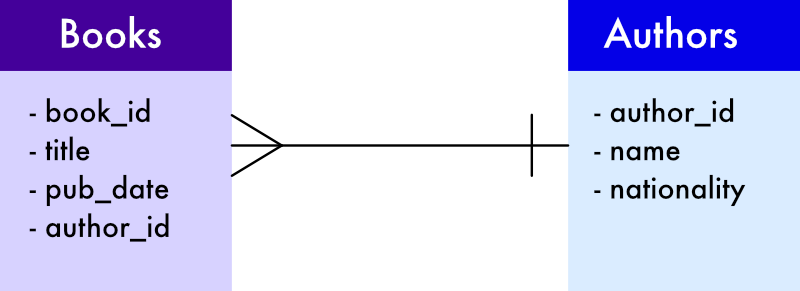

# Relationships in SQL / SQL JOINs

## Learning Objectives

- Define what a foreign key is
- Describe how to represent a one-to-many relationship in SQL database
- Explain how to represent one-to-one and many-to-many relationships in a SQL DB
- Distinguish between keys, foreign keys, and indexes
- Describe the purpose of the JOIN
- Use JOIN to combine tables in a SELECT
- Describe what it means for a database to be normalized

## Introduction

One of the key features of relational databases is that they can represent relationships between rows in different tables.

Going back to our library example, we have two tables: `books` and `authors`. Our goal now is to somehow indicate the relationship between a book and an author. In this case, that relationship indicates who wrote the book.

You can imagine that we'd like to use this information in a number of ways, such as...
- Getting the author information for a given book
- Getting all books written by a given author
- Searching for books based on attributes of the author (e.g., all books written by a Chinese author)

## One-to-Many (10 minutes / 2:20)

How might we represent this information in our database? For this example,
let's assume that each book has only one author (even though that's not always
the case in the real world).

#### Option 1 - Duplicate Info (Wrong :x:)

**authors**
- name
- nationality
- birth_year

**books**
- title
- pub_date
- author_name
- author_nationality
- author_birth_year

<details>
  <summary><strong>What's the problem here?</strong></summary>

  > Duplication, difficult to keep data in sync.

</details>

#### Option 2 - Array of IDs (Wrong :x:)

**authors**
- name
- nationality
- book_ids

**books**
- title
- pub_date

<details>
  <summary><strong>What's the problem here?</strong></summary>

  > Parsing list, can't index (for speed!)

</details>

#### Option 3 (Correct! :white_check_mark:)

**authors**
- name
- nationality

**books**
- title
- pub_date
- author_id



## Bonus: Joins

To `SELECT` information on two or more tables at ones, we can use a `JOIN` clause.
This will produce rows that contain information from both tables. When joining
two or more tables, we have to tell the database how to match up the rows.
(e.g. to make sure the author information is correct for each book).

This is done using the `ON` clause, which specifies which properties to match.

### Writing SQL JOINS

```sql
SELECT id FROM authors where name = 'J.K. Rowling';
SELECT * FROM books where author_id = 2;

SELECT * FROM books JOIN authors ON books.author_id = authors.id;
SELECT * FROM books JOIN authors ON books.author_id = authors.id WHERE authors.nationality = 'United States of America';
```

## You Do: Books and Authors

See advanced_queries.sql in the [library_sql](https://github.com/ga-dc/library_sql)
exercise.

## Aside: Less Common Joins

There are actually a number of ways to join multiple tables with `JOIN`, if
you're really curious, check out this article:

[A visual explanation of SQL Joins](http://blog.codinghorror.com/a-visual-explanation-of-sql-joins/)

## Bonus: Many-to-Many Relationships

We're not going to go in-depth with many-to-many relationships today, but lets go over a simple example...

Consider if we wanted to add a categories model (e.g. fiction, non-fiction,
sci-fi, romance, etc). Books can belong to many categories (i.e. a book might be
a fiction/romance, or a history/non-fiction). And a given category might have
many books.

Because of this, we can't put a book_id column on categories, nor a category_id
column on books, either way, we might have more than one value in that field
(a no-no in terms of performance).

To solution is to create an additional table, which stores just the
relationships between the two tables. Such a table is called a join table, and
contains two foreign key columns.

In our example, we might create a table called 'categorizations', and it would
have a book_id and category_id. Each row would represent a specific book's
association with a specific category.


## Closing/Questions (10 minutes)
